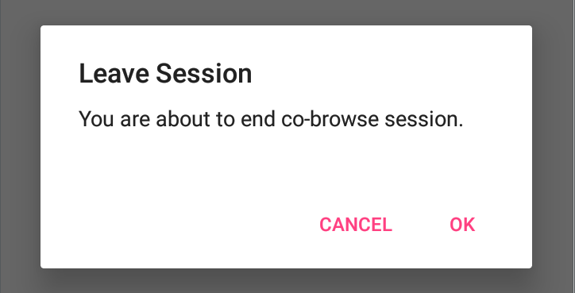
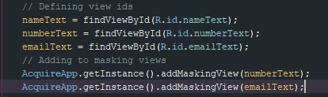
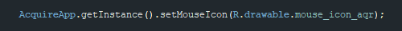

# Cobrowse

Acquire has this feature called Co-browsing which is unique in its sense, as it allows an agent to browse the session with the customer so that he/she can get the desired product/services on their website to purchase.

To use Cobrowse in your own app, you'll need to add our Native SDKs. We've made this as simple as possible, with just a few lines of code.

Once the Native SDKs are added to your app, everything else is done through our web dashboard in any browser - no plugins or installs needed.

### Features {#features}


 With Co-Browse any Agent can not only see his customer's screen but also he can access device with mouse and for text input, an Agent can type on customer device using his hardware keyboard. Isn't it fantastic!



 Even more he can add overlays or highlight on the customer's device in real time.


### Android SDK Sample App {#android-sdk-sample-app}

If you want a sample app for cobrowse\_only sdk version , you can download the sample app with integrated our sdk from Github: [Sample App](https://github.com/acquireio/co-browse-only-android)

{% embed data="{\"url\":\"https://www.youtube.com/watch?v=sptkhM5n3Vc\",\"type\":\"video\",\"title\":\"\",\"icon\":{\"type\":\"icon\",\"url\":\"https://www.youtube.com/yts/img/favicon\_144-vfliLAfaB.png\",\"width\":144,\"height\":144,\"aspectRatio\":1},\"thumbnail\":{\"type\":\"thumbnail\",\"url\":\"https://i.ytimg.com/vi/sptkhM5n3Vc/maxresdefault.jpg\",\"width\":1280,\"height\":720,\"aspectRatio\":0.5625},\"embed\":{\"type\":\"player\",\"url\":\"https://www.youtube.com/embed/sptkhM5n3Vc?rel=0&showinfo=0\",\"html\":\"<div style=\\\"left: 0; width: 100%; height: 0; position: relative; padding-bottom: 56.2493%;\\\"><iframe src=\\\"https://www.youtube.com/embed/sptkhM5n3Vc?rel=0&amp;showinfo=0\\\" style=\\\"border: 0; top: 0; left: 0; width: 100%; height: 100%; position: absolute;\\\" allowfullscreen scrolling=\\\"no\\\"></iframe></div>\",\"aspectRatio\":1.7778}}" %}

### Steps to integrate Cobrowse only sdk

First of all you will need to add our maven link to your project **build.gradle** file.

```javascript
allprojects {
    repositories {
        maven {
            // Add this line 
            url "http://107.155.116.28:8086/artifactory/libs-release-local"
        }
    }
}
```

Now you will need to add following dependencies to your app level **build.gradle** file :

```javascript
implementation 'com.acquireio:cobrowse_only:1.+'*
implementation 'com.android.support:design:27.1.1'
implementation 'com.android.support:appcompat-v7:28.0.0-rc01'
implementation('io.socket:socket.io-client:1.0.0') {
   exclude group: 'org.json', module: 'json'
}
```

\*`com`.acquireio:cobrowse\_only  is a compact library with only co-browse facility.


 All these features are included to our **core** library too.​[Follow these steps for this.](https://developer.acquire.io/~/edit/drafts/-LOIEbmu5jEwcJkDe2Mk/android/getting-started/integration-guide)


{% embed data="{\"url\":\"https://www.youtube.com/watch?v=m532XviU0aI\",\"type\":\"video\",\"title\":\"\",\"icon\":{\"type\":\"icon\",\"url\":\"https://www.youtube.com/yts/img/favicon\_144-vfliLAfaB.png\",\"width\":144,\"height\":144,\"aspectRatio\":1},\"thumbnail\":{\"type\":\"thumbnail\",\"url\":\"https://i.ytimg.com/vi/m532XviU0aI/maxresdefault.jpg\",\"width\":1280,\"height\":720,\"aspectRatio\":0.5625},\"embed\":{\"type\":\"player\",\"url\":\"https://www.youtube.com/embed/m532XviU0aI?rel=0&showinfo=0\",\"html\":\"<div style=\\\"left: 0; width: 100%; height: 0; position: relative; padding-bottom: 56.2493%;\\\"><iframe src=\\\"https://www.youtube.com/embed/m532XviU0aI?rel=0&amp;showinfo=0\\\" style=\\\"border: 0; top: 0; left: 0; width: 100%; height: 100%; position: absolute;\\\" allowfullscreen scrolling=\\\"no\\\"></iframe></div>\",\"aspectRatio\":1.7778}}" %}

If you want to customize cobrowse settings then you can use our CobrowseBuilder class.

### CobrowseBuilder class provides following options :

1. **`setMAX_UPDATE_TIME(long MAX_UPDATE_TIME)`** :

```javascript
/**
 * Default Value - 1000L
 *
 * @param MAX_UPDATE_TIME - set the time of sending frames when screen is idle
 */
```

 2. **`setMIN_UPDATE_TIME(long MIN_UPDATE_TIME)`** :

```javascript
/**
 * Default Value - 400L
 *
 * @param MIN_UPDATE_TIME - This is the minimum interval for sending screenshots
 */
```

 3. **`setBITMAP_QUALITY (int BITMAP_QUALITY)`** :

```javascript
/**
 * Default is quality is set to 10
 *
 * @param BITMAP_QUALITY - Set Screen shot quality ranges from 1-100
 */
```

 4. **`setCoBrowseCODE(String coBrowseCODE)`** :

```javascript
/**
 * By default this is the automated random number
 * @param coBrowseCODE - Pass any Alpha-numeric value in form of String
 */
```

 5. **`setHideStopButton(boolean hideStopButton)`** :


```javascript
/**
 * After session is connected you can choose to show our stop button or not
 * @param hideStopButton - Pass true to hide the stop button.
 */
```

 6. **`setConfirmStop(boolean enable)`** :



```javascript
/**
 * You can enable/disable our confirmation dialog
 * @param enable - Pass true to show prompt on end session call
 */
```

#### e.g.

```javascript
Create CoBrowse cobrowse = new CoBrowse.CobrowseBuilder().setConfirmStop(false).setBITMAP_QUALITY(10).build();
```

 And then pass it to **initCobrowse** method :

```javascript
AcquireApp.initCobrowse(Application, [Your Account Id],cobrowse);
```

After initialization you can use both events callbacks :

* **OnSessionEvents** And
* **OnCoBrowseEvent**

**To get full understanding of all delegates** [**click here**](../acquire-delegates.md)**.**

### **Useful methods to control the UI while co browsing.** 

#### Add mask to user's private data



#### Set masking view color


#### Set mouse icon which appears on user screen 



