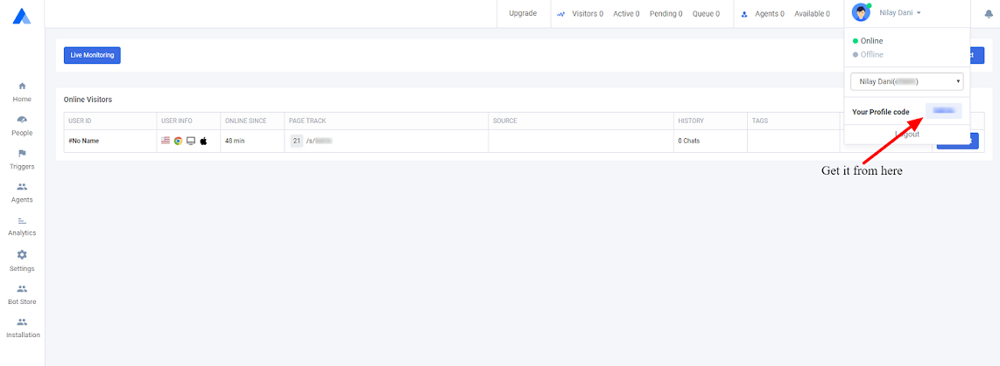

# Start using Acquire

### Initialize Acquire sdk :

There are several ways to initialize acquire sdk :

#### 1_._ Standard**:** 

```java
init(Application application, String accountId)
```

Call this method from an Activity or an Application ****subclass. 

It is recommended ****to use application subclass for better performance.

[Here](https://stackoverflow.com/a/2929927) is a guide to register application class in your manifest file.

Get your Account ID :

You can find your **`accountID`**as shown in image below :



#### 2. Using options :

```java
initWithOptions(Application application, String accountId, boolean showVideoButton, boolean showAudioButton)
```

To change default buttons behavior pass as per application requirement.

* **showVideoButton** - Show video button in top tab of chat screen on visitor's main chat messages screen. Default value is set to true.
* **showAudioButton** - Show audio button in top tab of chat screen on visitor's main chat messages screen. Default value is set to true.

#### 3. With custom co-browse settings:

```java
initCobrowse(Application application, String accId, CoBrowse coBrowse)
```

To know more about cobrowse [click here](../cobrowse-sdk.md).

### Permissions Description <a id="permissions-description"></a>

We include the **INTERNET** permission by default as we need it to make network requests :

```text
<uses-permission android:name="android.permission.INTERNET"/>
```

 In the AndroidManifest.xml file.

#### Run-time permissions

* To make Audio/Video calls camera and record audio permissions are needed so it will ask in marshmallow and above devices. Before marshmallow it is granted by default as mentioned in **AndroidManifest.xml**.

```text
<uses-permission android:name="android.permission.CAMERA" /> <uses-permission android:name="android.permission.RECORD_AUDIO" />
```


Audio/video calls will not work if these permissions are not granted.


* To share attachments from device Read and Write External Storage permissions are needed so it will ask in marshmallow and above devices. Before marshmallow it is granted by default as mentioned in **AndroidManifest.xml.**

```text
<uses-permission android:name="android.permission.READ_EXTERNAL_STORAGE" /> <uses-permission android:name="android.permission.WRITE_EXTERNAL_STORAGE"/>
```


User will be unable to share attachment if these permissions are not granted.


