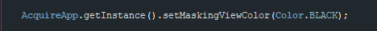

# Android Cobrowse SDK

Acquire has this feature called Co-browsing which is unique in its sense, as it allows an agent to browse the session with the customer so that he/she can get the desired product/services on their website to purchase.

To use Cobrowse in your own app, you'll need to add our Native SDKs. We've made this as simple as possible, with just a few lines of code.

Once the Native SDKs are added to your app, everything else is done through our web dashboard in any browser - no plugins or installs needed.

### Features {#features}


 With Co-Browse any Agent can not only see his customer's screen but also he can access device with mouse and for text input, an Agent can type on customer device using his hardware keyboard. Isn't it fantastic!



 Even more he can add overlays or highlight on the customer's device in real time.


### Android SDK Sample App {#android-sdk-sample-app}

If you want a sample app for cobrowse\_only sdk version , you can download the sample app with integrated our sdk from Github: [Sample App](https://github.com/acquireio/co-browse-only-android)


First of all you will need to add our maven link to your project gradle file.

```javascript
allprojects {
    repositories {
        maven {
            // Add this line 
            url "http://107.155.116.28:8086/artifactory/libs-release-local"
        }
    }
}
```

 You need to add following dependencies to your app level gradle file :

 If co browse only mode is activated in your account then you can use our specific android-sdk version for it.

```javascript
implementation 'com.acquireio:cobrowse_only:1.+'*
implementation 'com.android.support:design:27.1.1'
implementation 'com.android.support:appcompat-v7:28.0.0-rc01'
implementation('io.socket:socket.io-client:1.0.0') {
   exclude group: 'org.json', module: 'json'
}
```

Initialization of the sdk is same as normal integration.

[Follow this steps for this.](https://developers.acquire.io/initialization-android)

If you want to customize cobrowse settings then you can use our builder class.

Our builder class provides following options :

1. **`setMAX_UPDATE_TIME(long MAX_UPDATE_TIME)`** :

```javascript
/**
 * Default Value - 1000L
 *
 * @param MAX_UPDATE_TIME - set the time of sending frames when screen is idle
 */
```

 2. **`setMIN_UPDATE_TIME(long MIN_UPDATE_TIME)`** :

```javascript
/**
 * Default Value - 400L
 *
 * @param MIN_UPDATE_TIME - This is the minimum interval for sending screenshots
 */
```

 3. **`setBITMAP_QUALITY (int BITMAP_QUALITY)`** :

```javascript
/**
 * Default is quality is set to 10
 *
 * @param BITMAP_QUALITY - Set Screen shot quality ranges from 1-100
 */
```

 4. **`setCoBrowseCODE(String coBrowseCODE)`** :

```javascript
/**
 * By default this is the automated random number
 * @param coBrowseCODE - Pass any Alpha-numeric value in form of String
 */
```

 5. **`setHideStopButton(boolean hideStopButton)`** :


```javascript
/**
 * After session is connected you can choose to show our stop button or not
 * @param hideStopButton - Pass true to hide the stop button.
 */
```

 6. **`setConfirmStop(boolean enable)`** :


```javascript
/**
 * You can enable/disable our confirmation dialog
 * @param enable - Pass true to show prompt on end session call
 */
```

```javascript
Create CoBrowse cobrowse = new CoBrowse.CobrowseBuilder().setConfirmStop(false).setBITMAP_QUALITY(10).build();
```

 And then pass it to initCobrowse method :

```javascript
AcquireApp.initCobrowse(Application, [Your Account Id],cobrowse);
```


After initialization you can use both events callbacks :

* **OnSessionEvents** And
* **OnCoBrowseEvent**

From `OnSessionEvents` , you can start co-browsing by calling **`AcquireApp.getInstance().startSupportChat();`** Within **`onSessionConnected()`**

For Cobrowse only mode you will get below callback events by setting up `OnCoBrowseEvent` listener. Use method **`AcquireApp.getInstance().setSessionListner(this);`**  
**`AcquireApp.getInstance().setCoBrowseSessionListner(this);`**

to register listeners.

Here is the complete understanding of these callbacks:

1.**`onCoBrowseConnect(String s)`** : Will be invoked when co browse session is connected and also you can get random id from its argument.

2.**`onCoBrowseConnect(String s)`** : Will be invoked when co browse session is connected and also you can get random id from its argument.


3.**`onAgentConnected()`** : This is invoked when agent start connection by entering same random id which user has got.  



4.**`onCoBrowseDisconnect(String name)`** : this method is invoked when co browsing session is disconnected. Also it will tell you who \(agent/user\) has disconnected the session.

5. **`onCoBrowseFailed()`** : will be invoked when socket connection fails to connect.

6.**`onCoBrowseError()`** : will be invoked when socket gives any error while running session.


7.**`logOut()`**: To flush out all acquire components call this method.But keep in mind , after calling logout no api of our sdk will work.

