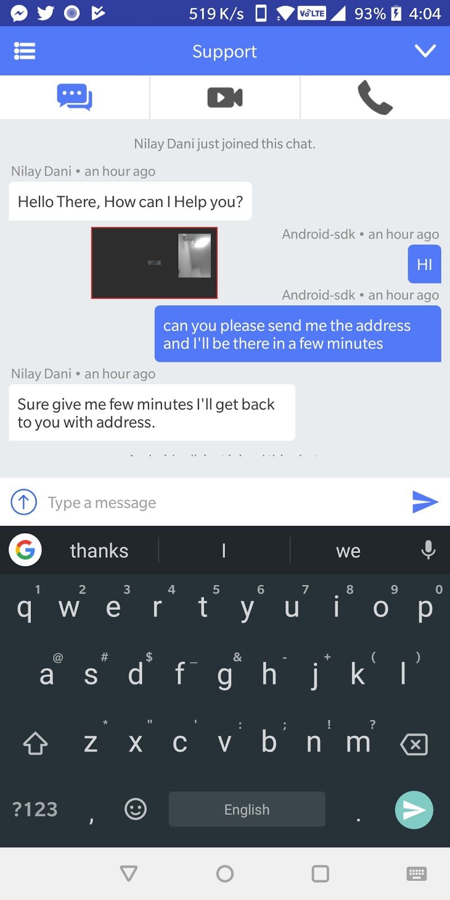

# API Explore

### Change Your User Hash

**`setVisitorHash( String visitorHash )`**

Pass visitorHash as per account configuration. Keep it secure. Please use this method before any initialization process of the sdk. Otherwise it will not affect.

### Set your user details

Set your user details as per your need \(Optional\)

You can customize visitor’s identification by calling our sdk’s method setVisitorDetail.

**Method Description : `setVisitorDetail(String name, String email, String phone, JSONObject fields)`:**

* **`@param name`** - the name you want to display for the visitor
* **`@param email`** - the email you want to display for the visitor
* **`@param phone`**  - the phone you want to display for the visitor
* **`@param fields`**  - pass the extra fields within a `JSONObject` e.g.

```javascript
 JSONObject jsonObject = new JSONObject();
       try {
               jsonObject.put([name] : "sample", [value] :"sucess");
            } catch (JSONException e) {
               e.printStackTrace();
            }
```

 Update these Details as per needed\(all optional\)**\*\*\*\***.


 **\*\*\*\*Note:** Use this method before initialization of sdk otherwise not work.


### Show support FAB automatically

Show support FAB automatically to all activities \(Optional\)

Show support FloatingActionButton with **`setShowDefaultFAB`** method.

If set to true then FloatingActionButton will be added to all your activities which are extended to our **`BaseActivity`** \(Full Identifier : **`com.acquireio.sdk.activities.BaseActivity`** \)\*.

**Method Description : `setShowDefaultFAB(showFAB)` :**

**`@param showFAB`** - Pass the boolean value true or false whether you want to show sdk's default FAB button or not.


 **Note:** Use this method before Activity's **`setContentView()`** method. On click of the button chat will open by default. By default, it’s set to false.


```javascript
Usage :
  @Override
   protected void onCreate(Bundle savedInstanceState) {
       super.onCreate(savedInstanceState);
       AcquireApp.setShowDefaultFAB(true);
       setContentView(R.layout.activity_main);
       initView();
   }
```

### Show Floating Video \(PIP mode\)

Show Floating Video \(PIP mode\) everywhere in your app\(Optional\)

To use this feature you will need to extend your Activity to our **`BaseActivity`** \(Full Identifier : **`com.acquireio.sdk.activities.BaseActivity)`**`*`




 **\*Note :** By extending to our **BaseActivity** will result to change your view with required content. It will not manipulate your UI or remove anything, it will just add **FloatingActionButton** to your existing layout if option is turned ON.


### Get custom callback events

Get custom callback events anywhere in your app \(Optional\)

You can get all callback events by implementing this interface\*\* **`ServerBackendSocket.onSessionEvents`**. \(Full Identifier: **`com.acquireio.callbacks.onSessionEvents`**`)`.

**Method Description : `setSessionListner(sessionListner)`:**

**`@param sessionListner`** - Pass the activity/fragment where you have implemented ServerBackendSocket.onSessionEvents from our sdk. Set custom session events listener for our sdk callback events.

**\*\*Note :**Set the listener manually by calling this method : **`AcquireApp.getInstance().setSessionListner(this);`** to get callbacks to anywhere you require. For session events usage see below:

### Get unread messages count {#get-unread-messages-count}

Get unread messages count anywhere in your app \(Optional\)

You can get unread messages count by implementing this interface **UnreadMessageCount** \(Full Identifier : **`com.acquireio.callbacks.UnreadMessageCount`**`)`.

**Method Description : `setUnreadCountListner(target-activity)`:**

**`@param target-activity`** - Pass the activity/fragment where you want to have unread messages count. Update Text or Badge count as per needed\*\*\*.


 **\*\*\*Note:** Remember to use **runOnUiThread** while updating UI.


### Upload files directly to the acquire server {#upload-files-directly-to-the-acquire-server}

```javascript
uploadFileToAcquire(Activity context, String filePath, UploadFileListener uploadFileListener)
```

In this method pass the activity context , file path and listener for success and failure callbacks.

This method will upload file to our server directly.

### User logout {#user-logout}

**`logOut()`**

This method will reset visitor’s all data and stops all connections to the agent including ongoing call.

```javascript
AcquireApp.logOut();
```


 **Caution:** Please take a note that all methods of the sdk will stop working after logout so resulting in crash on some method calls. You need to re-initialize the sdk to start again.



