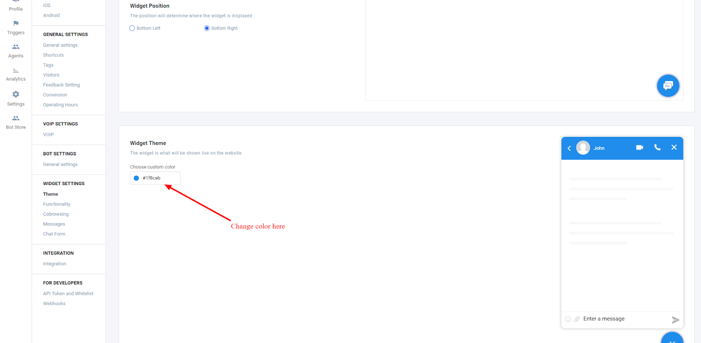
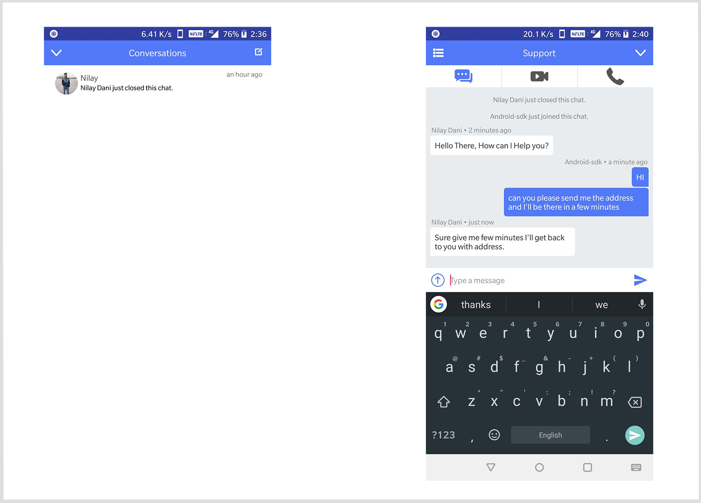

# Custom UI and server URL

### Custom UI for chat module

Set Custom UI for chat module \(Optional\)

#### How it works

Go to [https://app.acquire.io/widget/theme](https://app.acquire.io/widget/theme) - :

Whole Chat module will change according to this Background color. If not provided then it will use default primary colors of your app.

Here is the snapshots how our UI looks:

### Start sdk with custom server URL

**Start sdk with custom server URL\(Optional\)**

You can set your custom server url with following method.

**`AcquireApp.initWithServer([Application],[Custom Socket UR],[Your Account Id]);`**

Use this method before starting sdk otherwise it will not work.

