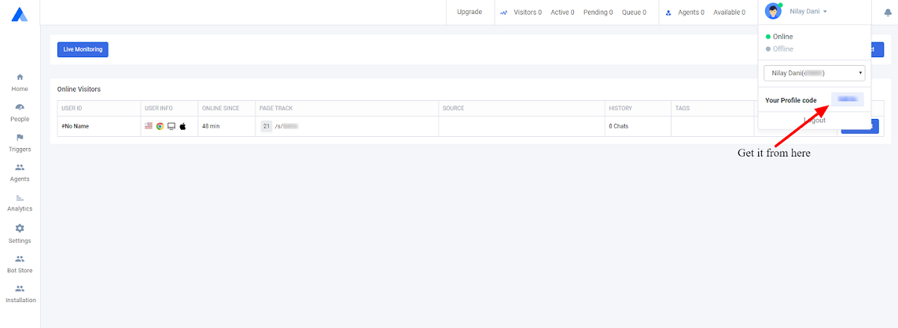

# Initialization

### Initialize sdk in your application:

You will need to initialize sdk from the Application class.you will need to declare application to AndroidManifest.xml.

Just you need to place the Account ID.

#### **Method Description : init\(Application, accountID\):**

* **`@param application`** : Application - Pass application instance
* **`@param accountID`**: String - Id of the account


 **Note :** For push notification see **Enable push notification in Sample app Section**.


### Steps to initialize our sample app

#### Add your Account ID \(required\)

Open the downloaded project in Android Studio, replace Account ID in Application Class. **`AcquireApp.init(this, [YOUR ACCOUNT ID])`**

For this you need to [register application class in your manifest file](https://stackoverflow.com/a/2929927).

You can find your **account ID** as shown in image below

**`initWithOptions`** \(Application application, String **accountId**, boolean `showVideoButton`, boolean **`showAudioButton`**\)

* **Application** - Pass your Application instance.
* **accountId** - Same as per **`init()`** function.
* **showVideoButton** - Show video button in top tab of chat screen on visitor's main chat messages screen. Default value true.
* **showAudioButton** - Show audio button in top tab of chat screen on visitor's main chat messages screen. Default value true.

#### Enable push notification \(optional\)

* You must have a Firebase account. Sign up to Firebase console and create your application with sample app package name and generate push notification google json service file replace that in sample app under app folder.
* Go to Acquire Dashboard and update the FCM server key under  _**`Setting -> Push Notification -> FCM Server Key`**_ .
* You need to set the FCM token for the app with the following method available with our sdk **`AcquireApp.setFireBaseToken ([FCM Token]);`**

