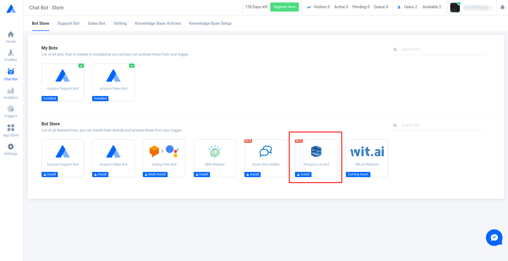
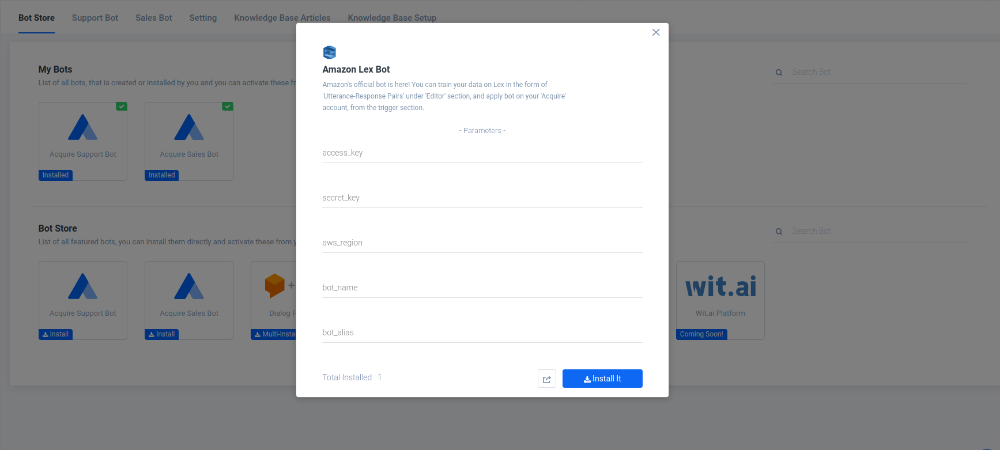
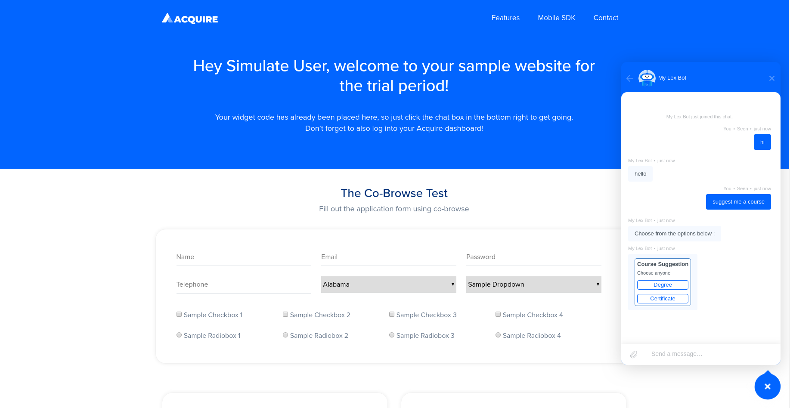

# Amazon Lex Bot

**Introduction**

Amazon Lex is a service that provides Automatic Speech Recognition \(ASR\) and Natural Language Understanding \(NLU\) to build conversational models. Acquire now supports ‘Amazon Lex’ chatbot along with many other 3rd party chatbots. Amazon Lex can be installed and used easily alongside the Acquire Chat Widget.

**Quick Setup**

Amazon Lex Provides functionality to create multiple bots. Each bots can have multiple intents to add utterance-response pairs \(question-answer pairs\). You need to provide a set of parameters to integrate your **“Amazon Lex bot”** with **“Acquire Chat Widget”**.

Follow the simple steps given below to install the “Acquire Chat Widget” integrated with “Amazon Lex”.

**1.** Go to [https://aws.amazon.com/lex/](https://aws.amazon.com/lex/) to access **“Amazon Lex”** platform. Click on **“Get Started with Amazon Lex”** and follow the Sign In procedure or Sign up procedure \(if you don't already have an AWS account\).

**2.** After logging in, you will be taken to a screen similar to the one given below. Click on **“Get Started”** . This will lead you to the Bot Creation Module.

**3.** Here, you can choose to use an existing bot from the **“TRY A SAMPLE”** options or you can create a custom bot by choosing to **“CREATE YOUR OWN”**. Sample bots have an existing set of intents. We will create a custom bot to understand the whole procedure.

**4.** Click on **“Custom bot”** and fill the details required. Provide a new bot name. The **“Bot name”** is one of the parameters that will be used to connect our **“Acquire Chat widget”** with **“Amazon Lex Bot”**. Fill all the other required details as per your preference and then click on **“Create”**.

**5.** Now, you will have access to the Bot Editor as you have created your first bot. Create a new intent using **“Create Intent”**. Give your intent a name and click on **“ADD”**.

**6.** Now, you are inside the editor of your newly created intent. You can add multiple user inputs \(questions\) into **“Sample Utterances”** and bot response into the **“Response”** section. 

**7.** Response messages can be in 2 different formats. \(a\) **“Add Message”** helps to add simple text messages and \(b\) **“Enable response card”** provides a card format, where you can add images. You can also add buttons as quick replies in these response cards. At least one simple text response is mandatory in order to enable the response card. 

**8.** Under the **“Add Message”** section, you may also choose **“Custom Markup”**, here you can also use webhook variables provided by the **“Acquire Chat Widget”** \(i.e. visitor\_name, visitor\_email, visitor\_phone , premium\_amount, etc.\)

**9.** Amazon Lex also provides some further customizable options as follows:

**\(a\). Fulfillment :** Always select **“Return parameters to client”** in order to connect your Amazon Lex Bot with the **“Acquire Chat Widget”**.

**\(b\). Slots :** You can also prompt questions to the users and store user responses in the form of slot values. You can utilise **“Built-in slot types”** to store user inputs or you can create your own **“Custom slot types”** from the left sidebar of the Editor.

You can also use response cards with **“Slots”** to collect information from users, as response cards can provide quick replies.

**\(c\). Confirmation Prompt :** Here you can confirm user inputs by asking an additional question to the user. You can also set a message prompt to display when users deny the confirmation.

**10.** Once you have created your intent, you need to click **“Save Intent”** and then **“Build”** the bot.

**11.** If the build is successful, you can publish your bot to be used by the **“Acquire Chat Widget”**. You will be asked to create a new alias to publish your bot which is known as **“Bot alias”**. Then click on **“Publish”**.

**12.** Now, you need to collect all the parameter values in order to integrate your "**Amazon Lex"** Bot with the "**Acquire Chat Widget**".

The **Bot Name** & **Alias** are ****displayed in step 11 \(highlighted in the red box\).

In order to get your **Secret Key** and **Access key**, you need to follow the procedure below:

**\(a\).** Go to **Amazon IAM service**.

**\(b\).** Go to **“Manage Security Credentials”** in **“Delete your access keys”** section.

**\(c\).** Select **“Get Started with IAM users”**.

**\(d\).** Enter a new **“Username”** and check the box named **“Programming access”**.

**\(e\).** Now, you can add the user to an existing group or create a new group. Click on **“Create Group”** to create a new group.

**\(f\).** Give a new name to the group and add permissions of **“AmazonLexReadOnly”** and **“AmazonLexRunBotsOnly”** and then click on **“Create Group”**.

**\(g\).** Next **“Add tags”** section is optional. You can simply go to **“Next”**.

Review all the information and press **“Create User”**.

Here, you can obtain your **“Access key ID”** and **“Secret access key”**. You can also download a CSV file to save these credentials.

**13.** You can always access the value of region from the "**Amazon Lex"** homepage URL

**https://&lt;aws\_region&gt;.console.aws.amazon.com.**  

**14.** Now, we have all the parameters to connect our "**Amazon Lex"** bot with the **“Acquire Chat Widget”**. 

So, let us install the "**Amazon Lex** **Bot**" from the Bot Store.

| **access\_key** | **Access key ID \(Step 12\)** |
| :--- | :--- |
| secret\_key | Secret access key \(Step 12\) |
| aws\_region | Step 13 |
| bot\_name | Bot name \(Step 11\) |
| bot\_alias | Alias \(Step 11\) |

**15.** Go to **“Triggers”** and apply **“Amazon Lex Bot”** chatbot.

**16.** Finally, You can test the "**Acquire Chat Widget"** using the intents you have created with "**Amazon Lex"**.

