# Dialog Flow Chat-Bot

### **Introduction**

 As you know Acquire is now a platform of various Chat-Bots, here you can use ChatBot of **“Acquire”** itself as well as other integrated ChatBot too. If you want to use a ChatBot of 3rd party, Acquire provide a large number of Bots in Bot Store listing and a few more will be coming soon. From Acquire Bot Store, Google’s Dialog Flow is one of popular ChatBot. it works alongside Acquire Chat Widget.

### **Quick Steps**

Dialog flow has its own knowledge base section, where we can train own question and answer that helpful to Chat-Bot to handle our visitor. To bind **“Google’s Dialog Flow”** with **“Acquire Chat Widget”**, we need to pass few required parameters.  Everyone can install **“Dialog Flow Chat-Bot”** easily by following these few simple steps:

#### • **Normal Q&A Chat:**

**1.** First of all, we have an account on **“Dialog Flow”** Panel. Go to [https://console.dialogflow.com/api-client/\#/login](https://console.dialogflow.com/api-client/#/login) and use your Gmail ID to access Dialog Flow Panel. 

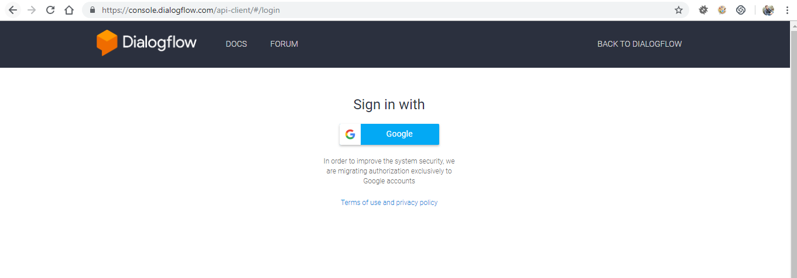

**2.** Now you have access of an empty account of Dialog flow panel, you have to create an agent for you. 

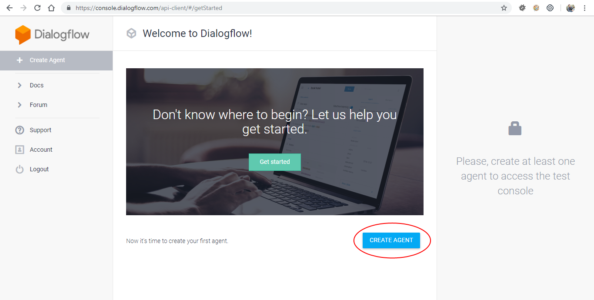

**3.** Put your Agent Name at the top, and select the language type that you want to train you Chat-Bot.

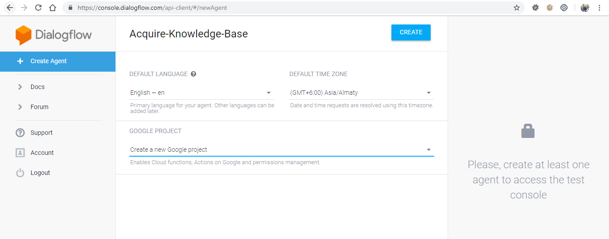

**4.** After pressing **“CREATE”** it may take a few seconds to prepare that agent. Then you will get an agent with empty phrases, now you have to put your all phrases that you want to train your Chat-Bot to answer all those queries that asked by visitors. To build a knowledge base you have to create **“Intents”** on it.

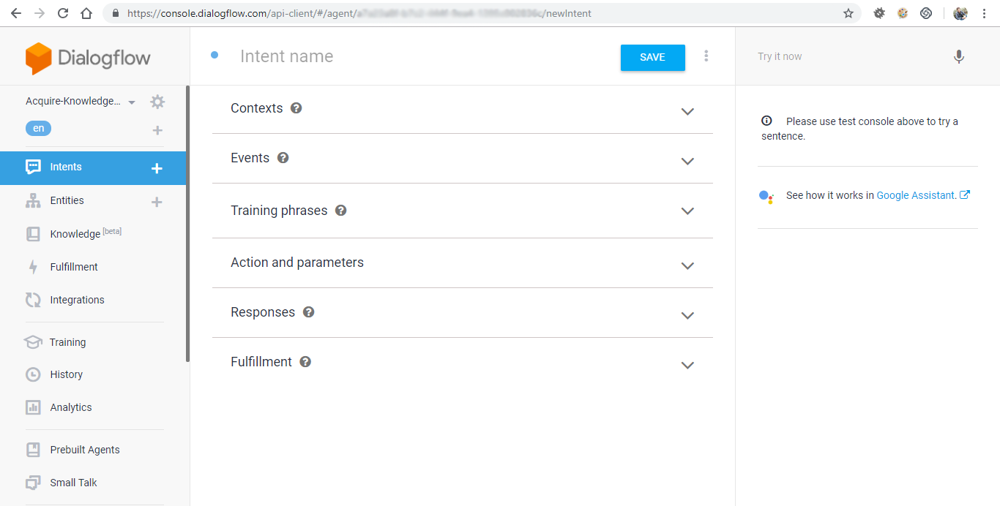

**5.** Here you can see lots of Collapse tabs in Intent section; here you can put all your queries in **“Training Phrases”** Tab. And put all your responses of those queries in **“Responses”** Tab.

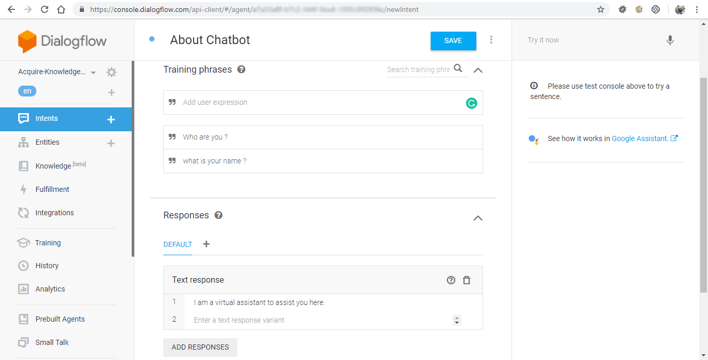

**6.** After saving that Intent, now a gear icon will start to spin that indicates that Dialog flow prepares its knowledge base for new upcoming intents.

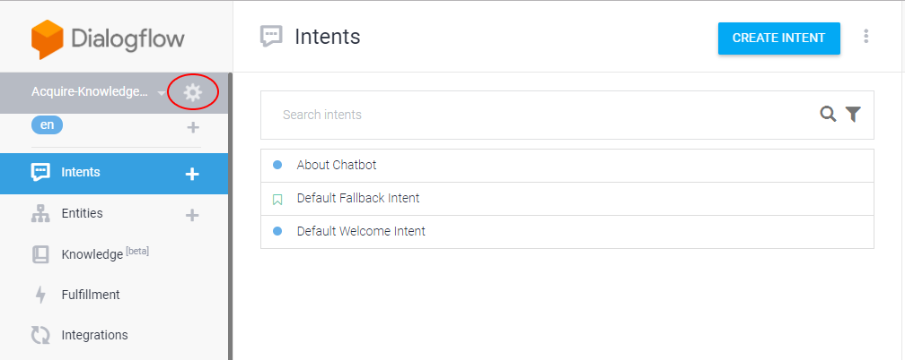

**7.** After putting all your phrases, Go to Acquire’s Bot Section, here you can see there are lots of 3rd party Chat-bots also you will find a **“Dialog Flow Bot”** in this list.

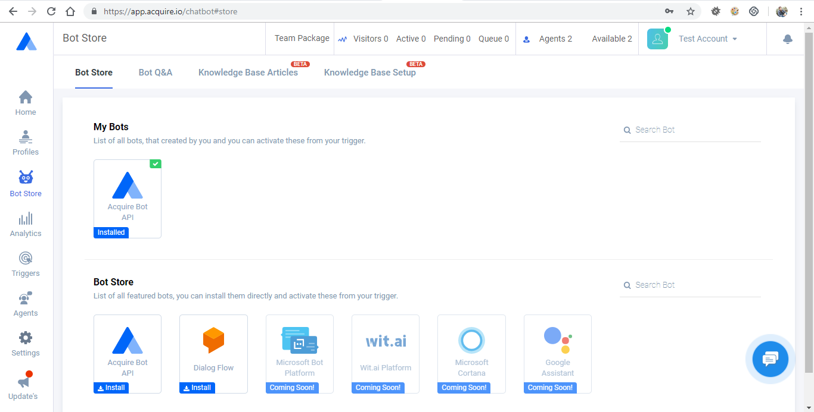

**8.** Click on that and a popup will be displayed. You need few parameters \(i.e. “client\_access\_token” and “language”\) to bind it with chat widget.

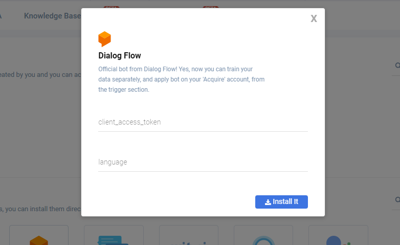

**9.** To get your **“client\_access\_token”**, go to Dialog flow and press on gear icon that is displayed next to your agent name. Here you can access all settings related to your agent. Copy your **“Client Access Token”** from **“General”** Tab and paste it to **“Acquire”** popup.

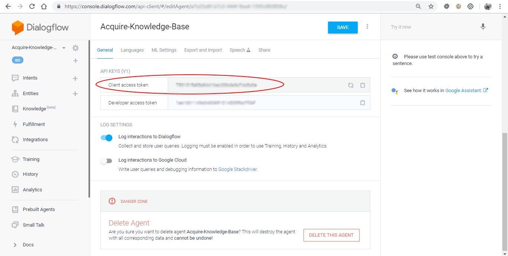

**10.** To find out your 2nd parameter \(language\) in Acquire popup, you have to get language code of that language, in which you will train your Chatbots’ knowledge base. See the below screenshot you will find your language code and put it into Acquire popup.

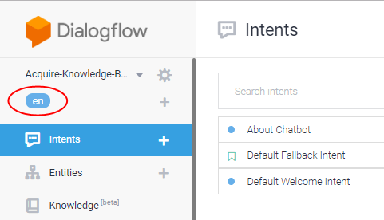

**11.** All are setup, now we are good to go and press the install button.

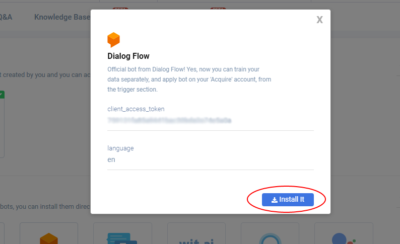

**12.** From **“Trigger”** section, apply it where you want. It will answer all your visitors’ queries.

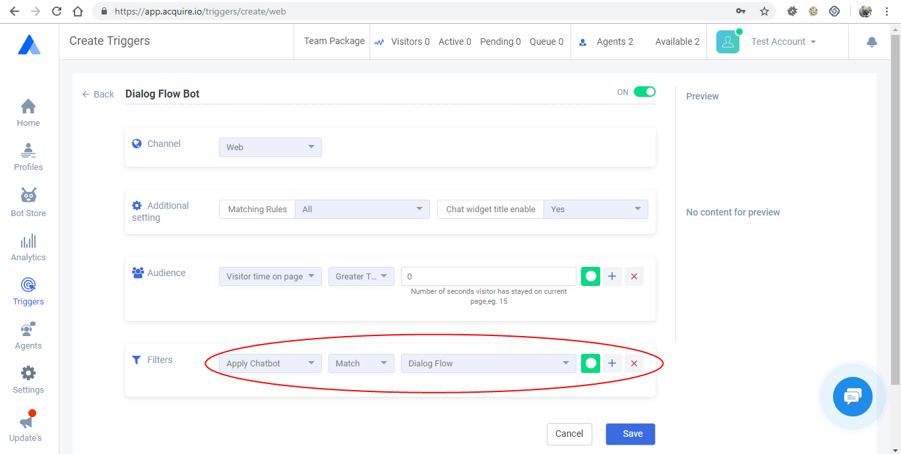

**13.** Now go to your simulate page to test your Chatbot by putting the different type of questions.

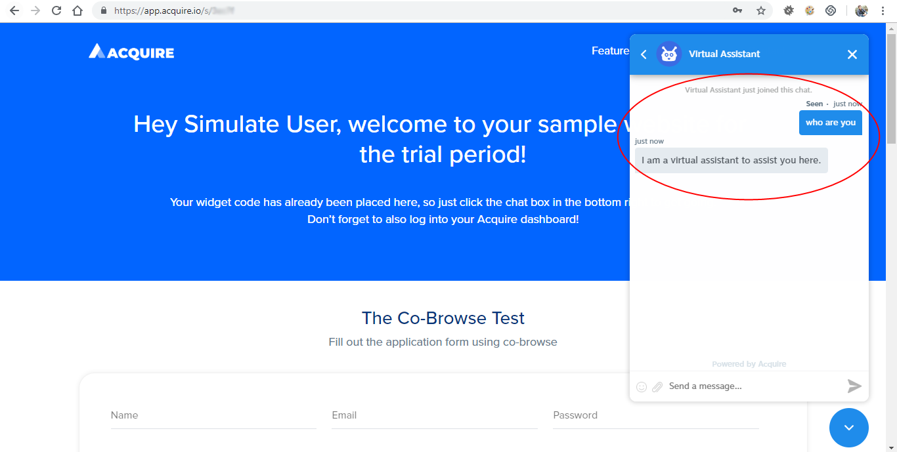

#### 

#### • Q&A with Suggestion chips\(buttons\):

We know how “Dialog Flow” is easy to use, now we make few things, that will make our chat more interactive. For this additional feature we have to attach a new thing, named as “Google Assistant Tab” in “Response” section of that particular intent. It helps us to add Suggestions chips for any response, which can helpful to our user to get clear out on that topic. Let configure some suggestion chips \(buttons\) for an intent.

**1.**  First of all make a decent knowledge base for our Bot. Then go to that intent, where we want to add buttons.

**2.**  You can see a tab named “DEFAULT” in the “Response” section. For Buttons you have to add a new tab “GOOGLE ASSISTANT” by clicking on '+' icon.

**3.**  Under “GOOGLE ASSISTANT” Tab, click on “ADD RESPONSES” then after select “Suggestion Chips” from given list.

**4.**  Now create few suggestions of questions that you have added in your knowledge base. Each suggestion chip accepts only up to 26 characters. So you have to put unique keywords of those questions.

**5.**  Like: we have question in knowledge base is “Can I deploy the Chabot to Facebook messenger?” and we will add this in suggestion like “Deploy Chatbot to FB”.

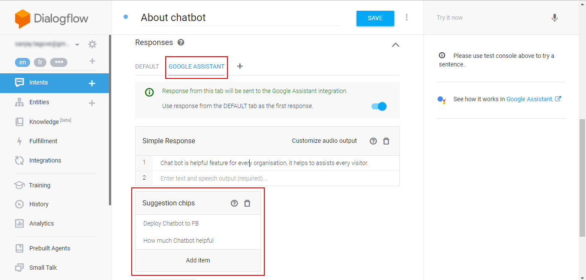

**6.**  Whenever particular intent will be trigger, response always comes with those suggestion buttons. User simply click on one of those buttons and dialog flow will response on that query.

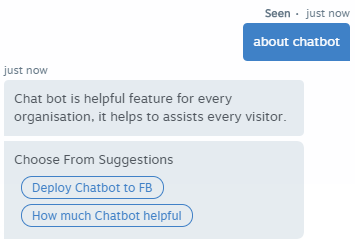

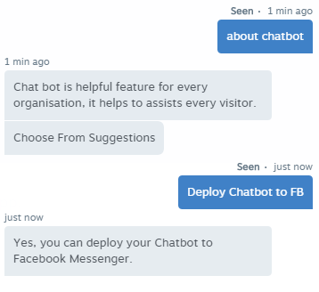

```

```

