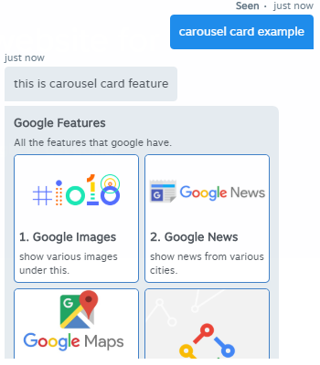
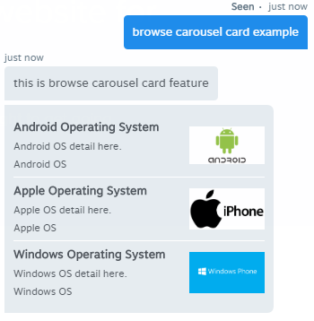

# Dialog Flow Chat-Bot

### **Introduction**

 As you know Acquire is now a platform of various Chat-Bots, here you can use ChatBot of **“Acquire”** itself as well as other integrated ChatBot too. If you want to use a ChatBot of 3rd party, Acquire provide a large number of Bots in Bot Store listing and a few more will be coming soon. From Acquire Bot Store, Google’s Dialog Flow is one of popular ChatBot. it works alongside Acquire Chat Widget.

### Quick Installation Steps

Dialog flow has its own knowledge base section, where we can train own question and answer that helpful to Chat-Bot to handle our visitor. To bind **“Google’s Dialog Flow”** with **“Acquire Chat Widget”**, we need to pass few required parameters.  Everyone can install **“Dialog Flow Chat-Bot”** easily by following these few simple steps:

**1.** First of all, we have an account on **“Dialog Flow”** Panel. Go to [https://console.dialogflow.com/api-client/\#/login](https://console.dialogflow.com/api-client/#/login) and use your Gmail ID to access Dialog Flow Panel. 


**2.** Now you have access of an empty account of Dialog flow panel, you have to create an agent for you. 


**3.** Put your Agent Name at the top, and select the language type that you want to train you Chat-Bot.


**4.** After pressing **“CREATE”** it may take a few seconds to prepare that agent. Then you will get an agent with empty phrases, now you have to put your all the phrases that you want to train your Chat-Bot to answer all those queries that asked by visitors. To build a knowledge base you have to create **“Intents”** on it.


**5.** Here you can see lots of Collapse tabs in Intent section; here you can put all your queries in **“Training Phrases”** Tab. And put all your responses of those queries in **“Responses”** Tab.


**6.** After saving that Intent, now a gear icon will start to spin that indicates that Dialog flow prepares its knowledge base for new upcoming intents.


**7.** After putting all your phrases, Go to Acquire’s Bot Section, here you can see there are lots of 3rd party Chat-bots also you will find a **“Dialog Flow Bot”** in this list.


**8.** Click on that and a popup will be displayed. You need few parameters \(i.e. “client\_access\_token” and “language”\) to bind it with chat widget.


**9.** To get your **“client\_access\_token”**, go to Dialog flow and press on gear icon that is displayed next to your agent name. Here you can access all settings related to your agent. Copy your **“Client Access Token”** from **“General”** Tab and paste it to **“Acquire”** popup.


**10.** To find out your 2nd parameter \(language\) in Acquire popup, you have to get language code of that language, in which you will train your Chatbots’ knowledge base. See the below screenshot you will find your language code and put it into Acquire popup.


**11.** All are set up, now we are good to go and press the install button.


**12.** From **“Trigger”** section, apply it where you want. It will answer all your visitors’ queries.


**13.** Now go to your simulate page to test your Chatbot by putting the different type of questions.


### 

### Google Assistant Responses:

This part describes various responses that Google Assistant provides. We know how “Dialog Flow” is easy to use, now we make few things, Like: Simple responses, Suggestion chips, Link out Suggestion, Carousel Card, Browse Carousel card etc., which will make our chat more interactive. For this additional feature, we have to attach a new thing named as “Google Assistant Tab” in “Response” section of that particular intent.


#### • Simple Response**:**

This is the common response, that worked as simple text-based response as we recently used in Installation part.


#### • Suggestion Chips**:**

It helps us to add Suggestions chips for any response, which can help to our user to get clear out on that topic. It's easy to create chips for an intent, you have to create few suggestions of questions that you have added in your knowledge base. Each suggestion chip accepts only 26 characters. So you have to put unique keywords of those questions. Like: we have a question in knowledge base is “Can I deploy the Chabot to Facebook messenger?” and we will add this in a suggestion like “Deploy Chatbot to FB”.


Whenever particular intent trigger response always come with those suggestion buttons. A user simply clicks on one of those buttons and dialog flow will response on that query.


#### • **Link-out** Suggestion**:**

It helps us to redirect our user to a specific page. You have to pass a destination name \(that will visible as the button to a user\) and a URL \(that user will redirect on\).


#### • Carousel Card**:**

The carousel displays as tiles format and allows for selecting one item. It helps a user to see various product list with images and It has richer content than any other response. each tile that make up carousel are similar to the basic card with an image. 


Selecting a tile from the carousel will simply generate a chat bubble as the response. It has limits of max 10 tiles and min 2 tiles in an intent**.**



#### • **Browse** Carousel Card**:**

It also allows the rich response, similar to carousel card. it scrolls horizontally and allows users to select a tile. These are designed for redirect user to specific web content by selecting any tile in a web browser.




Note: Till now, above all response type are supporting "Acquire Chat Widget", remain will be added soon.

```

```

