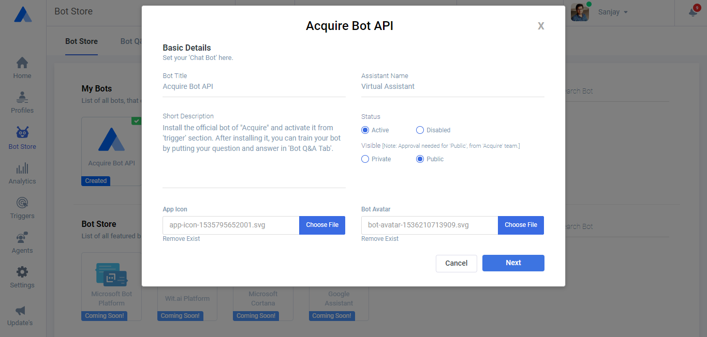
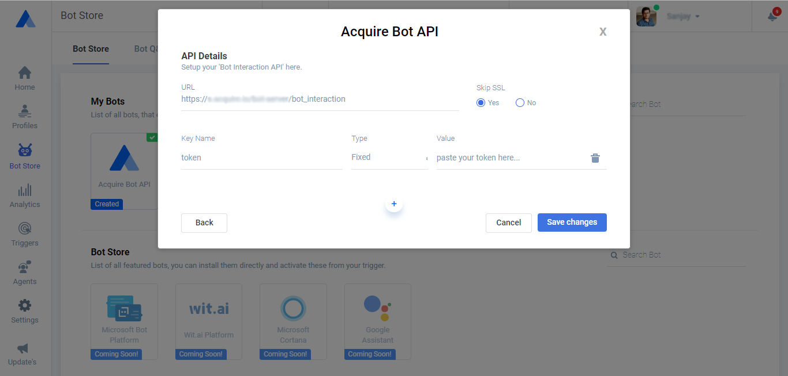

# Integrate Your Chatbot

### Introduction {#introduction}

You can use Acquire as platform, by creating your own Bot with API endpoint that describe within this document. You can also make your Bot public, by this other people can use your Bot as service. These are few examples that show how Acquire platform will accept the request and give response, from API Endpoint for Bot uses. You can make your own Web API and put that into below popup with given request format.

### Screenshots {#screenshots}

1. Here you can setup you Bot’s Basic Details:



 2. Here you can setup you Bot Interaction API with any dynamic parameters:



#### **About ‘type’ Parameter:**

We have various types for parameter ‘type’ like:

1. Request ‘type’ parameter:

1. **`init-chat`:** To initiate the Bot chat.
2. **`suggestion`**`:` To get the suggestions from Bot.
3. **`message`**`:` To ask a question to Bot.
4. more will be added soon\(like: button press, etc\)

2. Response ‘type’ parameter:

1. **`suggestion`**`:` It gives few matched questions for suggestion to visitor.
2. **`message`**`:` It gives the response that generated by the Bot.
3. **`transfer`**`:` If Bot stuck in any unanswered situation then it indicates that hat will be transfer to one of executive.
4. **`redirect`**`:` Useful when you want that your visitor have to redirect any given URL.
5. **`multiple-tasks`**`:` Indicates that response data have multiple actions or task.

Single API Endpoint with various example formats:

### Example 1. To activate or refresh the Bot:

Here you can see that, we can activate our Bot for that particular session or just we can refresh our Bot when any updation of Bot setting will occur, Bot will retrieve the updated data.

**`POST /bot_interaction`**

#### **Headers:**

| Parameter | Type |
| :--- | :--- |
| **`Content-type`** | application/x-www-form-urlencoded |

####  **Body**

| Parameter | Description |
| :--- | :--- |
| **`account_id`** | Account ID on which Bot is running. \(Internally managed\) |
| **`chat_id`** | Chat ID/Session ID \(Internally managed\) |
| **`type`** | init-chat |

####  **API Response will be:**

```javascript
{
    "success": true
}
```

### Example 2. To get suggestions from Bot:

This example shows that, if a visitor types a query to the Bot, then this example is helpful to directly select that query from suggestions.

**`POST /bot_interaction`**

#### **Headers:**

| Parameter | Type |
| :--- | :--- |
| **`Content-type`** | application/x-www-form-urlencoded |

#### **body**

| Parameter | Description |
| :--- | :--- |
| **`account_id`** | Account ID on which Bot is running. \(Internally managed\) |
| **`chat_id`** | Chat ID/Session ID \(Internally managed\) |
| **`type`** | suggestion |
| **`message`** | how bot |

####  **API Response will be:**

```javascript
{
    "success": true,
    "type": "suggestion",
    "data": [
        {
            "id": 1249,
            "question": "how does co browsing work",
            "formatted": "<strong>how</strong> does co browsing work"
        },
        {
            "id": 1251,
            "question": "bot work flow",
            "formatted": "<strong>bot</strong> work flow"
        }
    ]
}
```

### Example 3. To ask a message:

By this example a visitor can simply ask a question and get their response with given format.

**`POST /bot_interaction`**

#### **Headers:**

| Parameter | Type |
| :--- | :--- |
| **`Content-type`** | application/x-www-form-urlencoded |

#### **body**

| Parameter | Description |
| :--- | :--- |
| **`account_id`** | Account ID on which Bot is running. \(Internally managed\) |
| **`chat_id`** | Chat ID/Session ID \(Internally managed\) |
| **`type`** | message |
| **`message`** | hi |

####  **API Response will be:**

```javascript
{
    "success": true,
    "type": "message",
    "data": "Hello there!"
}
```

### Example 4. To ask a message that Bot doesn’t knows:

This example illustrate the condition when Bot have not any response for visitor, that time it gives response that given below. In the response we have two type of data\(message, event\), Bot gives the message as ‘Sorry, I am still learning...’ and then put a event that ‘Your chat is transferring...’. thenafter one of the executive pick that chat, and interact with that visitor directly.

**`POST /bot_interaction`**

#### **Headers:**

| Parameter | Type |
| :--- | :--- |
| **`Content-type`** | application/x-www-form-urlencoded |

#### **body**

| Parameter | Description |
| :--- | :--- |
| **`account_id`** | Account ID on which Bot is running. \(Internally managed\) |
| **`chat_id`** | Chat ID/Session ID \(Internally managed\) |
| **`type`** | message |
| **`message`** | do you sell banana |

####  **API Response will be:**

```javascript
{
    "success": true,
    "type": "transfer",
    "data": {
        "message": "Sorry, I am still learning and I can not answer this query right now. want 
                            to chat with our one of executive? ",
        "event": "Your chat is transferring with our one of the agents, agent will be with you 
                            shortly..."
    }
}
```

### Example 5. In case of multiple responses:

When visitor asks a query and we have multiple actions or tasks with that response message then Bot will manage that response like this below example.

**`POST /bot_interaction`**

#### **Headers:**

| Parameter | Type |
| :--- | :--- |
| **`Content-type`** | application/x-www-form-urlencoded |

#### **body**

| Parameter | Description |
| :--- | :--- |
| **`account_id`** | Account ID on which Bot is running. \(Internally managed\) |
| **`chat_id`** | Chat ID/Session ID \(Internally managed\) |
| **`type`** | message |
| **`message`** |  describe co browsing |

####  **API Response will be:**

```javascript
{
    "success": true,
    "type": "multiple-tasks",
    "data": [
        {
            "type": "message",
            "data": "Co-browsing allows you to see and interact with your customer’s web 
                           screen in real time."
        },
        {
            "type": "redirect",
            "data": {
                "message": "Let me redirect you to the specific page.",
                "link": " https://acquire.io/co-browsing/"
            }
        }
    ]
}
```


