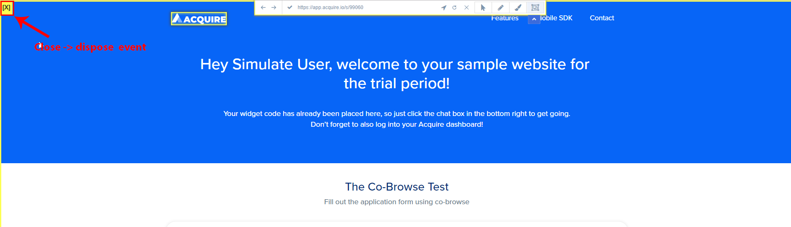

# Co Browse API

Acquire Co-browse is a collaboration tool that can be used during voice or chat interactions to enable a company representative to see the screen of the customer that he’s interacting with in real-time.

This allows agents to better understand a customer’s question or problem, and provide faster and more accurate help, leading to better resolutions and more satisfied customers.

Co-browsing is an indispensable sales conversion and customer support tool that drives business objectives as well as revenue. This document will cover the end-to-end deployment process and the most effective best practices to consider when planning, deploying and using the Acquire Co-browse solution, along with ways to measure its success.

Acquire Co browse API in you can use multiple events and manage custom easily.

### Co Browse Events

####  1. cobrowse-request

Acquire Co browse API event type 'cobrowse-request' user request send after call and this api given user's response true or false.

**`verified`** : verified, means if request is confirmed by visitor

**`cb`** : `(true,false)` This event defines if acquire will get confirmation from user or not. It depends on app settings.

####  **Sample Code**

```javascript
window.acquire.push(function(app){
        app.on('cobrowse-request',function (verified,cb) {
            // verified, means if request is confirmed by visitor.
            // cb  is callback, you must return either true or false to allow cobrowser
            //cb(true);// means allow cobrowse to happen
            console.log("cobrowse-request", verified,cb);
        });
    });
```

#### **2. cobrowse\_session**

'**`cobrowse_session`**' in three types event available.

* **`mirror`**
* **`mirror-dispose`**
* **`dispose`**

**`mirror`**: this event co-browsing request accept after just calling.


####  **Sample Code**

```javascript
window.acquire.push(function(app){
    app.on("cobrowse_session", function (cobrowse_session) {
            console.log("cobrowse_session ", cobrowse_session);
            cobrowse_session.on('mirror', function (param1, param2, param3) {
                console.log("mirror ", param1, param2, param3);
            });
        });
    });
```

 **`mirror-dispose`**: this event new page open and reload after calling.


####  **Sample Code**

```javascript
window.acquire.push(function(app){
    app.on("cobrowse_session", function (cobrowse_session) {
            console.log("cobrowse_session ", cobrowse_session);
            cobrowse_session.on('mirror-dispose', function (param1) {
                console.log("mirror-dispose ", param1);
            });
        });
    });

```

 **`dispose`**: this event co-browsing close after calling.



####  **Sample Code**

```javascript
window.acquire.push(function(app){
    app.on("cobrowse_session", function (cobrowse_session) {
            console.log("cobrowse_session ", cobrowse_session);
            cobrowse_session.on('dispose', function () {
                console.log("dispose ");
            });
        });
    });
    
```

 Hide customer sensitive information to agent.


 Please add this tag in your html text box:

 "**`data-skip-cobrowse`**"


####  **Sample Code to embed**

```markup
<input data-skip-cobrowse type="text" name="creditcard" placeholder="credit card number"> 
```

####  **Hide all text field and text data**

 "**`data-skipui-cobrowse`**"

```markup
<div data-skipui-cobrowse class="test-cobrowse-field">
	<p>This field all data Hide.</p>
</div>
```


### Co browse Custom Code API

Acquire Co-browse in you can start co-browsing on your customer custom code. For setup custom code open your web page and add acquire widget script.

After Acquire widget use this code and pass your 'CUSTOM\_ID'. This script in pass 'CUSTOM\_ID' is a unique co-browse code and you can connect co-browse to use this code.

```javascript
<script type="text/javascript">
      window.acquire=window.acquire||[];
         acquire.push({
            custom_cobrowse_code:'[CUSTOM_ID]'
         });
</script>
```


Custom Co Browse code work only run-time. Below  create a demo code view and  you can use this as your need.


#### Demo

Create a web page and put acquire script and custom code push function or follow screen shots.


