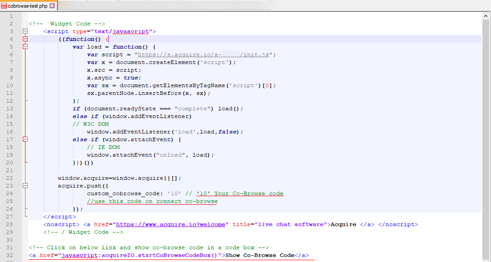
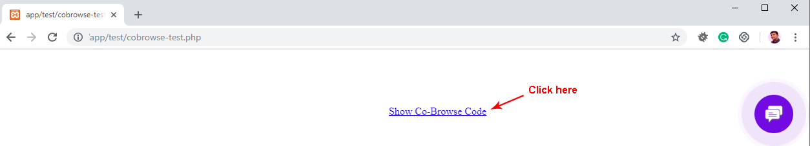
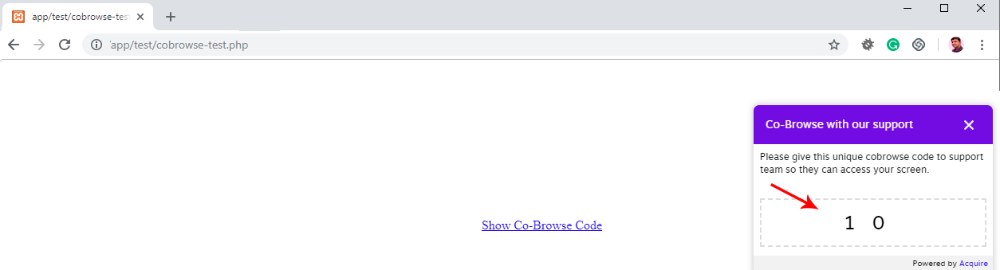

# Co Browse Custom Code

Acquire Co-browse in you can start co-browsing on your customer custom code. For setup custom code open your web page and add acquire widget script.

```javascript
<!--  Widget Code -->
<script type="text/javascript">((function(){
                var load=function(){
                    var script="https://s.acquire.io/a-[ACCOUNT_ID]/init.js?full";
                    var x=document.createElement('script');
                    x.src=script;x.async=true;
                    var sx=document.getElementsByTagName('script')[0];
                    sx.parentNode.insertBefore(x, sx);
                    
};
                if(document.readyState === "complete")
                    load();
                else if (window.addEventListener)  // W3C DOM
                    window.addEventListener('load',load,false);
                else if (window.attachEvent) { // IE DOM
                    window.attachEvent("onload", load);
                }
            })())</script>
 <noscript><a href="https://www.acquire.io?welcome" title="live chat software">Acquire</a></noscript>
<!-- / Widget Code -->  
```

After Acquire widget use this code and pass your 'CUSTOM\_ID'. This script in pass 'CUSTOM\_ID' is a unique co-browse code and you can connect co-browse to use this code.

```javascript
<script type="text/javascript">
      window.acquire=window.acquire||[];
         acquire.push({
            custom_cobrowse_code:'[CUSTOM_ID]'
         });
</script>
```


Custom Co Browse code work only run-time. Below  create a demo code view and  you can use this as your need.


#### Demo

Create a web page and put acquire script and custom code push function or follow screen shots.









