# iOS Push Notifications

To enable push notifications in Acquire you first need to create a .p12 certificate file of your Apple Push Certificate and upload it to Acquire \(we support both production and development .p12 files\).

### Step 1: Create App ID and APNS SSL Certificate <a id="step-1--create-app-id-and-apns-ssl-certificate"></a>

Login to [Apple developer account](https://developer.apple.com/account) and click Certificates, Identifiers and Profile


Select iOS from dropdown, select App IDs from side menu and create a new App I

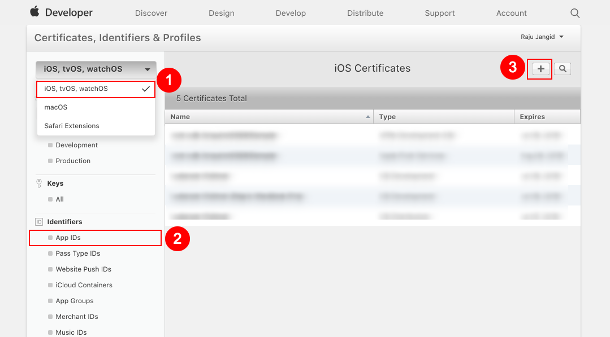

Specify App name, Bundle ID and select Push Notifications, then Continue

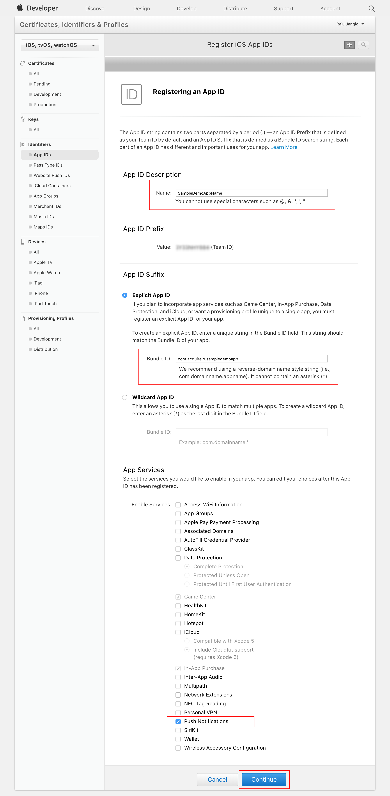

Click Register, then Done to complete app registration

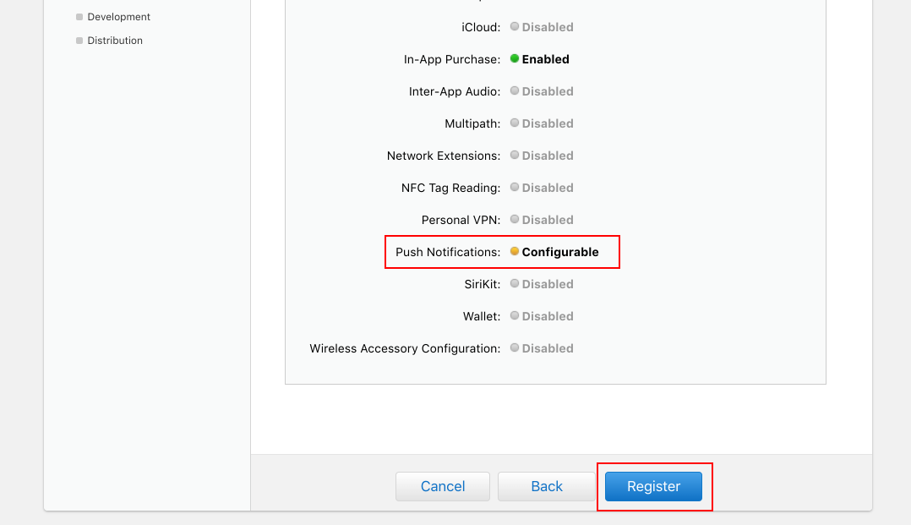

Now, you can see the app listed in App IDs

### Step 2: Generate APNS .p12 certificate <a id="step-2--generate-apns--p12-certificate"></a>

Launch the Keychain Access application in your Mac OS X and Select Keychain Access -&gt; Certificate Assistant -&gt; Request a Certificate From a Certificate Authority.

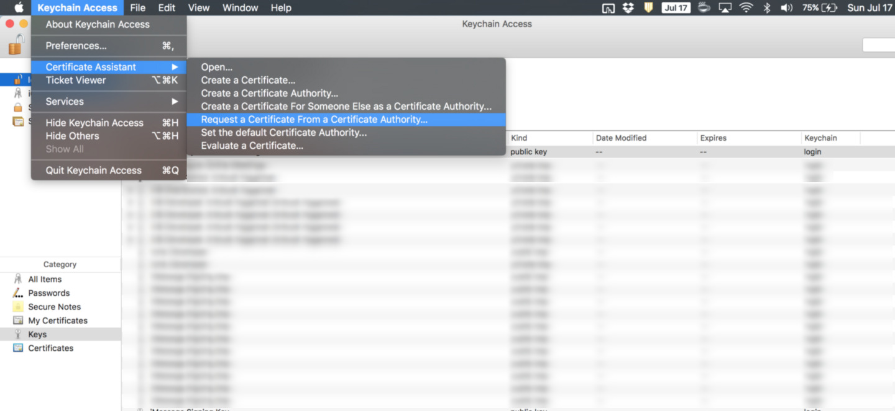

Enter email address and check the ‘Saved to disk’ option, then click Continue

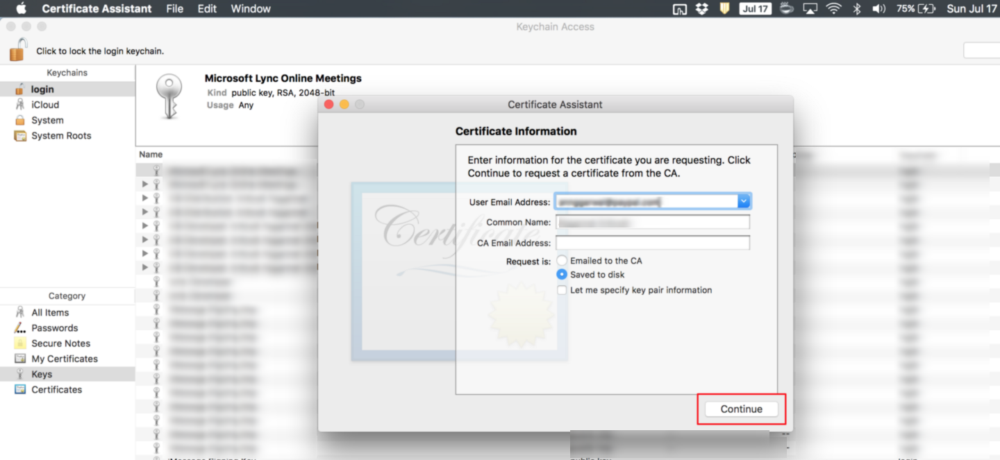

Save certificate

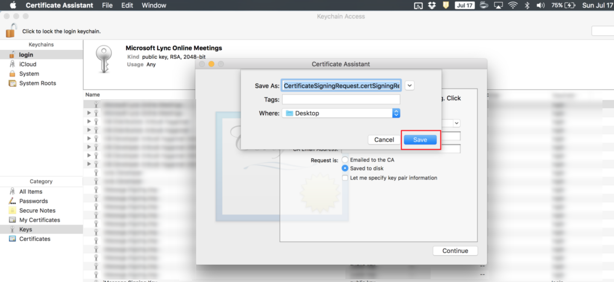

**Generate a Development Certificate**

Go back to developer account and select app from App IDs and click Edit

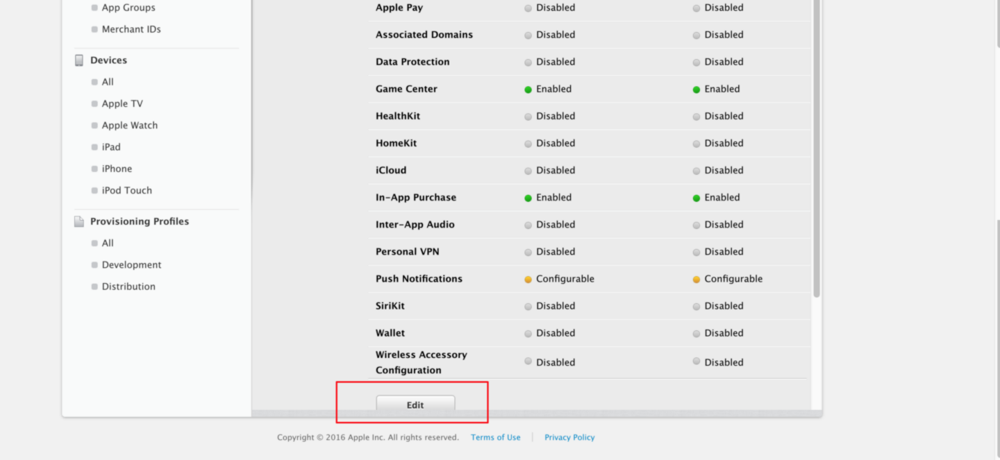

Scroll Down to Development SSL certificates and click Create Certificate

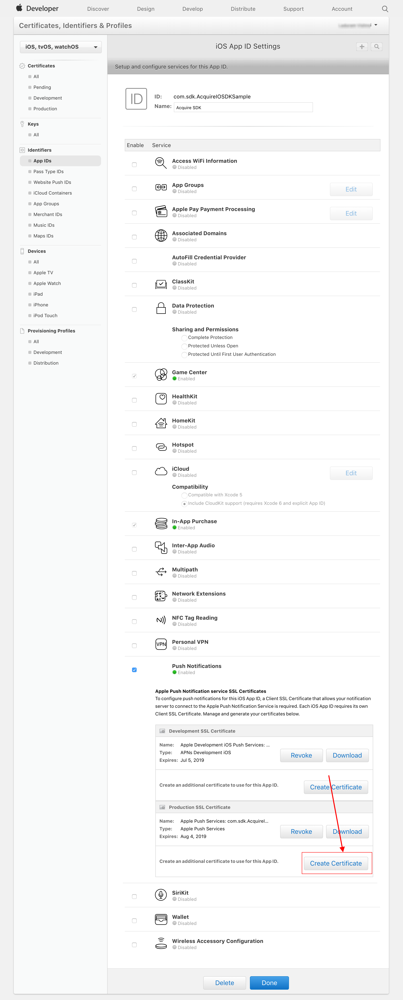

Click Continue

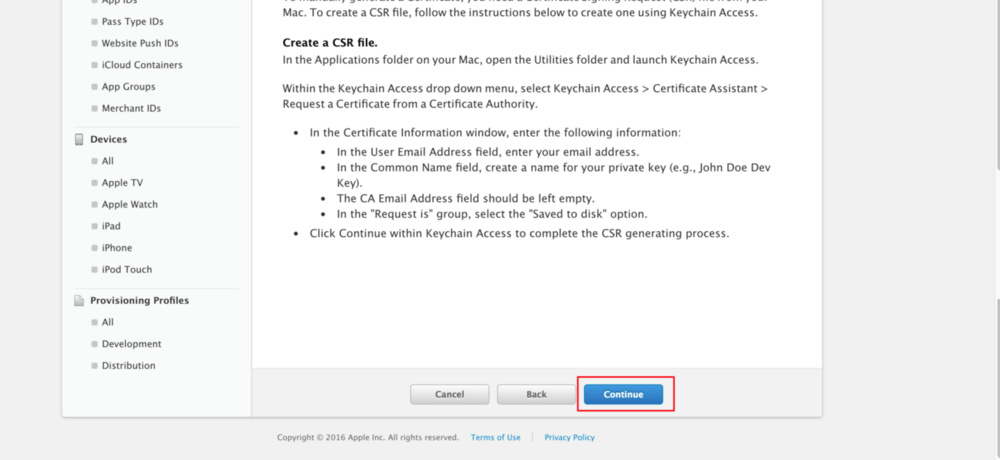

Choose certificate file created from Keychain Access in previous section and click Continue

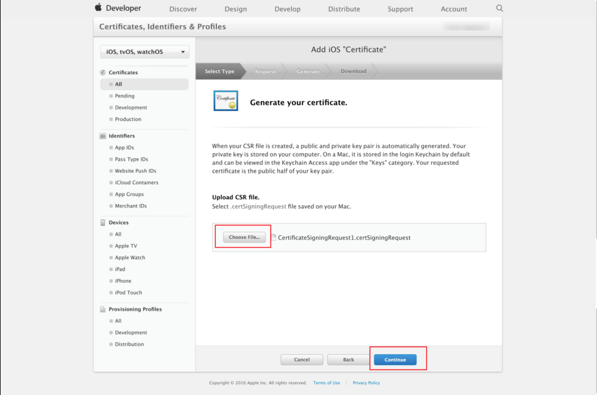

Download Development Certificate and click Done to finish process

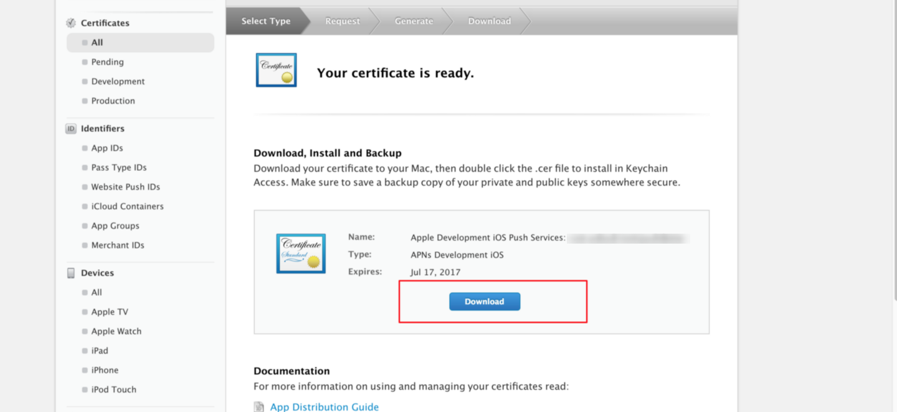

**Generate APNS .p12 certificate**

Double click Development certificate generated in previous step to add it to Keychain Access. Go to Keychain Access, select login keychain and My Certificate from side menu. Find app certificate and right click to export it

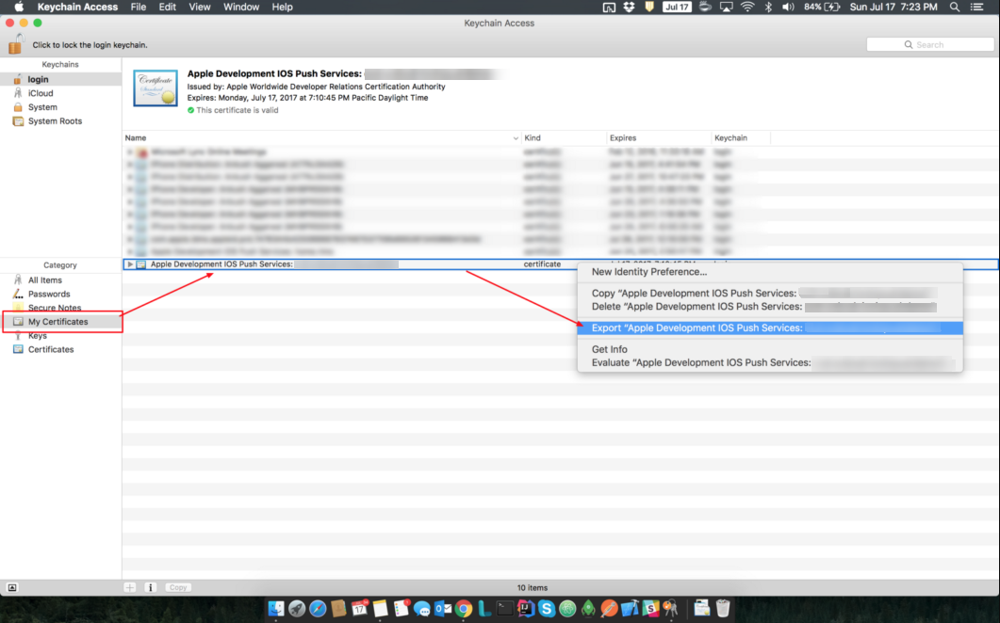

Enter certificate name and click Save

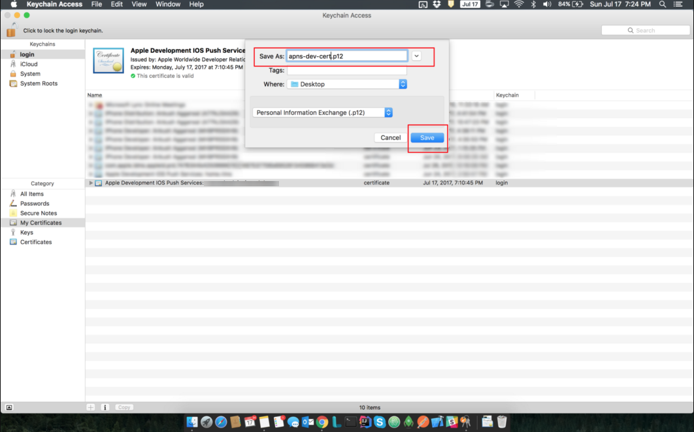

Enter password for certificate and click Ok

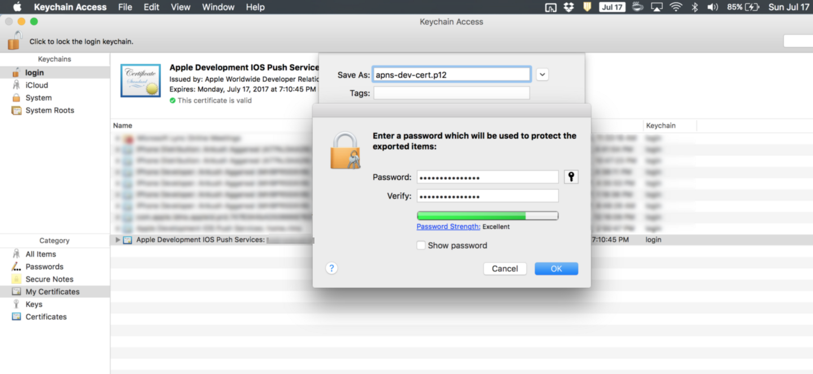

Enter your computer admin password to finish the process

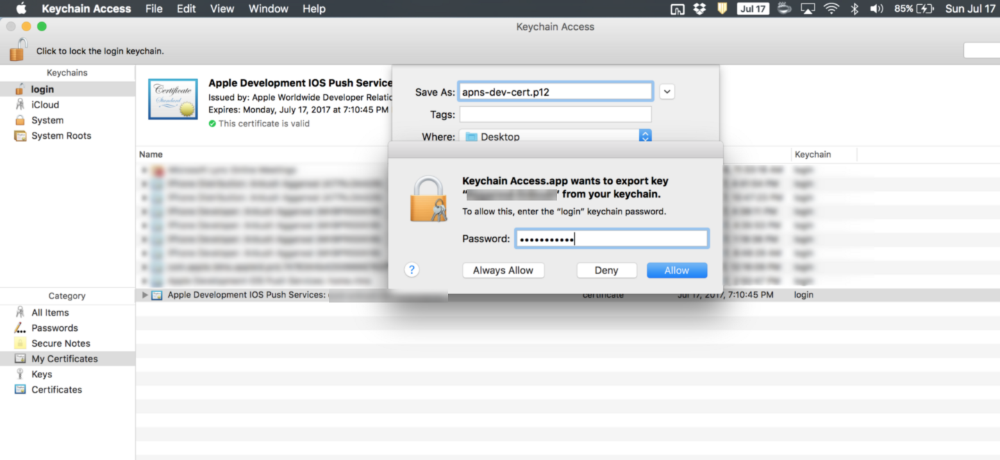

### Step 3: Upload .p12 file to Acquire

Boom! This development .p12 certificate can be used to send push notification. Go to your app's settings and select Acquire for iOS. You'll notice the "Enable Push Notifications" section where you'll be able to upload your newly created .p12 file.

### Step 4: Download the Provisioning Profile

You can skip this step if you have already configured your iOS app to support the Apple Push Notification Service \(APNS\).

1. Login to your Apple developer account. Create an iOS Provisioning Profile for the Production environment.
2. Select the App ID you created in Step 1 and generate / download the profile.
3. Double click the .mobileprovision file to import it into Xcode.
4. In the Xcode Build Settings for your target, select the correct Code Signing Identify and Provisioning Profile.
5. Install a build of the app on your iOS device.

### Step 5: Register with APNS and register Device Tokens <a id="step-5--register-with-apns-and-register-device-tokens"></a>

As usual, you should also register with the Apple Push Notification Service \(APNS\) by adding this code to applicationDidBecomeActive if you haven't already:



```objectivec
- (void)applicationDidBecomeActive:(UIApplication *)application {
		[application registerUserNotificationSettings:
		[UIUserNotificationSettings settingsForTypes:(UIUserNotificationTypeBadge | UIUserNotificationTypeSound | UIUserNotificationTypeAlert) categories:nil]];
		[application registerForRemoteNotifications];
}
```



```swift
func applicationDidBecomeActive(_ application: UIApplication) {
		let settings = UIUserNotificationSettings(types: [.badge, .sound, .alert], categories: nil)
		application.registerUserNotificationSettings(settings)
		application.registerForRemoteNotifications()
}
```



In order to enable your users to receive push notifications from Acquire via Acquire for iOS, you must register the device token of your user.



```objectivec
// [START receive_message]
   - (void)application:(UIApplication *)application didReceiveRemoteNotification:(NSDictionary *)userInfo {
      // If you are receiving a notification message while your app is in the background,
      // this callback will not be fired till the user taps on the notification launching the application.
      // TODO: Handle data of notification
    
      // With swizzling disabled you must let Messaging know about the message, for Analytics
      // [[AcquireIO sharedObject] appDidReceiveMessage:userInfo];
    
      // Print full message.
    
      [[AcquireIO support] appDidReceiveMessage:userInfo];
   }
```



```swift
func application(_ application: UIApplication, didRegisterForRemoteNotificationsWithDeviceToken deviceToken: Data) {
        var tokenType:AcquireIOAPNSTokenType = AcquireIOAPNSTokenType.prod
        
        #if DEBUG //Check your app is in development
        tokenType = AcquireIOAPNSTokenType.sandbox; //For development mode
        #endif
        AcquireIO.support().setAPNSToken(deviceToken, type: tokenType)
    }
```



At this stage you should make sure that you have enabled the Push Notifications capability in Xcode.


### Step 6: Handling Acquire Push Notifications <a id="step-6--handling-acquire-push-notifications"></a>

When your app receives a push notification Acquire for iOS checks to see if it is an Acquire push notification and opens the message if required. You do not need to implement any additional code in order to launch Acquire's UI once you have followed the instructions in step 5 above. To do this we safely swizzle the public methods in UIApplicationDelegate that handle receiving push notifications. We do not use any private APIs to do this.

**Manually handle push notifications \(Optional\)**

Optionally, you may disable the swizzling for push notifications by setting AcquireAutoIntegratePushNotifications to NO in your app's Info.plist. You will then need to handle Acquire push notifications as shown here:



```objectivec
- (void)applicationDidBecomeActive:(UIApplication *)application {
		[application registerUserNotificationSettings:
		[UIUserNotificationSettings settingsForTypes:(UIUserNotificationTypeBadge | UIUserNotificationTypeSound | UIUserNotificationTypeAlert) categories:nil]];
		[application registerForRemoteNotifications];
}
```



```swift
func applicationDidBecomeActive(_ application: UIApplication) {
		let settings = UIUserNotificationSettings(types: [.badge, .sound, .alert], categories: nil)
		application.registerUserNotificationSettings(settings)
		application.registerForRemoteNotifications()
}
```




Note: it is only necessary to do this if you decide to disable the automatic push notification handling.


### Step 7: Testing Acquire Push Notifications <a id="step-7--testing-acquire-push-notifications"></a>


You can easily test if push notifications are working properly in your app. Just send a manual message to the app user via Acquire.

**Badge Values**

Acquire never changes the badge value of your app. Thus we can ensure that whatever badge value you're managing in your app, we don't alter in any way.

**Troubleshooting**

If you are having trouble getting push notifications to work in your app, here's a list of things you should check:

* Ensure you ticked the box 'Send a push notification' when you send a manual message.
* When your push-enabled app registers for push notifications for the first time on a device, iOS asks the user if they wish to receive notifications for that app. So please verify that when you launch your app for the first time iOS shows you this alert view. You should tap OK in this case to allow iOS to send you push notifications.
* Do you get a token from APNS? If you put a breakpoint into the `application:didregisterforremotenotificationswithdevicetoken:` delegate call, you should get a token shortly after your app launches.
* Did you generate and upload the PEM file correctly? Make sure you downloaded the productionAPNS SLL certificate. Also, ensure you exported both the certificate and private key, and you created the p12 file with an empty password. Double-check that you uploaded the PEM file to the correct Acquire app \(TEST vs. Production\).
* You can find more technical information and troubleshooting steps in the [Apple iOS Developer Library](https://developer.apple.com/library/archive/technotes/tn2265/_index.html).

