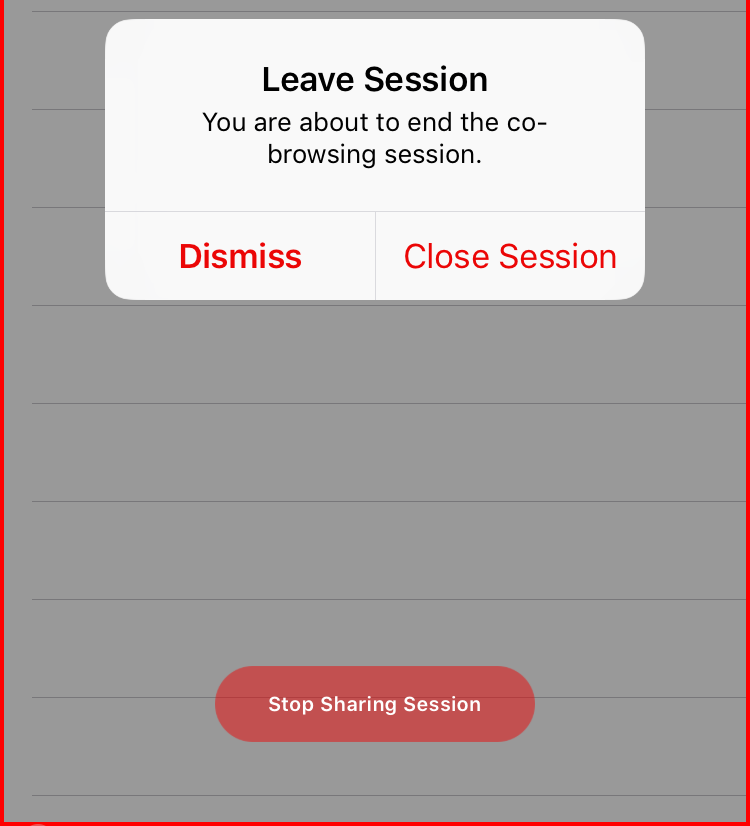
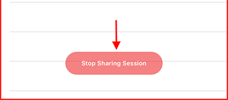

# iOS Cobrowse SDK

## Setup

```objectivec
pod 'AcquireIO-Cobrowse'            # For normal version
```

And run `pod install` or `pod update` to refresh your [cocoapods](https://cocoapods.org/) dependencies.

## Manual Integration

### Get the latest SDK zip

Download the latest for the AcquireIO iOS SDK.

### [`Download SDK Latest`](https://developers.acquire.io/sdk/ios/1.0.9/cobrowse/acquireIO.zip)\`\`

The zip file `AcquireIO.framework` contains

| File | Description |
| :--- | :--- |
| `AcquireIO.h` | AcquireIO main API header file |
| `AcquireIOClient.h` | Support API methods header file |
| `AcquireIO-Swift.h` | AcquireIO swift library for use Socket connection |
| `AcquireIOTheme/` | Folder containing theme configuration to match the design of your app |

### Add the latest stable SDK

**Add the latest stable SDK release to your project**

\*\*\*\*

* Unzip the SDK & drag-drop `acquireIO.framework` files into your Xcode project.
* In `Build Phases`, verify that `AcquireIO.framework` is in the `Link Binary with Libraries` and the AcquireIO resources are in `Copy Bundle Resources`
* Add the following frameworks to `Link Binary with Libraries` -
  * `CoreFoundation`
  * `CoreGraphics`
  * `QuartzCore`
  * `UIKit`

## Methods

### Get Cobrowse Code

Get visitor cobrowse code, when acquire session ready to connect

If acquire support session not started then it will return -1, otherwise session code to start cobrowse session with agent.


Available in SDK version 1.0.9 or later


**Sample code**



```objectivec
NSInteger code = [[AcquireIO support] getCobrowseCode];
```



```swift
let code = AcquireIO.support().getCobrowseCode()
```



### Add Mask on View

Adds a UIView to mask during the cobrowse session.

| Parameter | Type | Description |
| :--- | :--- | :--- |
| `view` | `id <UIView>` |  instance to mask _`required`_ |

Sample Code



```objectivec
//Mask UIImageView
[[AcquireIO support] addMaskedView:self.imageView];

//Mask UITextField
[[AcquireIO support] addMaskedView:self.textfield];

//Mask UITextView
[[AcquireIO support] addMaskedView:self.textview];
```



```text
//Mask UIImageView
AcquireIO.support().addMaskedView(self.imageView);

//Mask UITextField
AcquireIO.support().addMaskedView(self.textfield);

//Mask UITextView
AcquireIO.support().addMaskedView(self.textview);
```



### Remove Masked View

Remove a UIView from being masked during a cobrowse session.

**Sample Code**



```objectivec
[[AcquireIO support] removeMaskedView:self.yourMaskedView];
```



```swift
AcquireIO.support().removeMaskedView(self.yourMaskedView);
```



### Mask Keyboard

Masks the keyboard from being shown `(Default: NO)`

**Sample Code**



```objectivec
[[AcquireIO support] maskKeyboard:YES]
```



```swift
AcquireIO.support().maskKeyboard(true)
```



### Pause Sharing

Pause an active cobrowse session

**Sample Code**



```objectivec
[[AcquireIO support] pauseSharing];
```



```swift
AcquireIO.support().pauseSharing()
```



### Start Sharing

Start a cobrowse session with a agent. Note that for Visitor sessions already start sharing when agent start cobrowse session via code. You can Pause and start sharing again.


**init: no need to call first time. After pause then you can call this method**


**Sample Code**



```objectivec
[[AcquireIO support] startSharing];
```



```swift
AcquireIO.support().startSharing()
```



### End Sharing

End the cobrowse session. Calling endSharing initiates the process of ending the session.

Show prompt message for end confirmation, see:



**Parameter**

| **Parameter** | Type | Description |
| :--- | :--- | :--- |
| `showPrompt` | `boolean` | Pass bool value to show or not confirmation. |

**Sample Code**



```objectivec
[[AcquireIO support] endSharing:NO];
```



```swift
AcquireIO.support().endSharing(false)
```



### Remove Stop Sharing Button

After session is connected you can choose to show our stop button or not.



Add key `@"ShowDefaultStopButton"` for stop sharing button. Set Value `@NO` to hide the stop button.

Also check about how to add key in config dictionary, see this:



## Example app

If you want a sample app for cobrowse\_only SDK version , you can download the sample app with integrated our SDK from Github. Example app provided [here](https://github.com/acquireio/acquireio-cobrowse-ios) for both Objective-C.

Next: How to configure Acquire SDK in App, See this:




