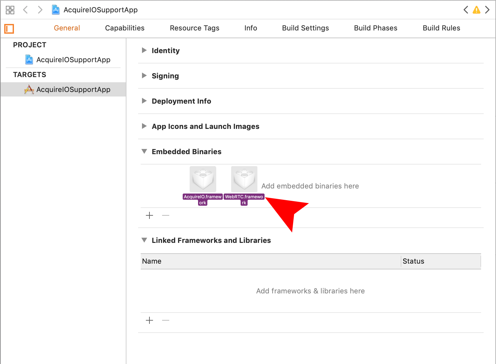
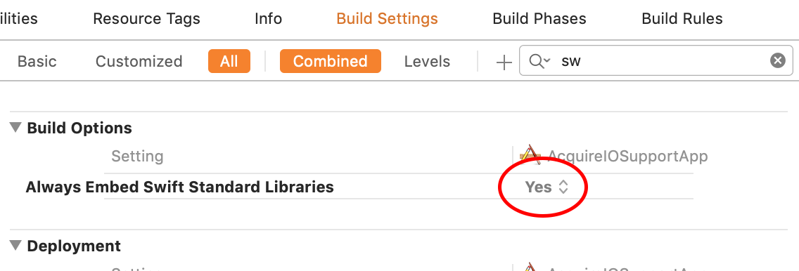
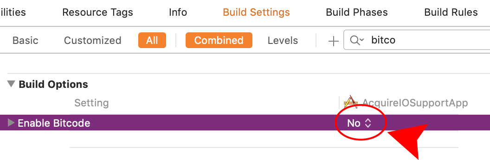

# Manual Setup iOS

You can install our SDK manually using the steps below for iOS.

First, [Download AcquireIO iOS SDK.](https://devtools.acquire.io/sdk/ios/2.0.0/acquireIO.zip)


Supports iOS 8.2 and above.


Unzip the SDK & Drop the `.framework` package into the "Embedded Binaries" list in your targets &gt; general tab. This will add the .framework to "Linked Frameworks and Libraries" as well.

Add the following frameworks to `Link Binary with Libraries` -

* `CoreFoundation`
* `CoreGraphics`
* `QuartzCore`
* `UIKit`

Go to Project/Targets -&gt; \[Project Name\] -&gt; Build Settings.  
Search `"ALWAYS_EMBED_SWIFT_STANDARD_LIBRARIES"`

Search `"Enable bitcode"` to `NO`



