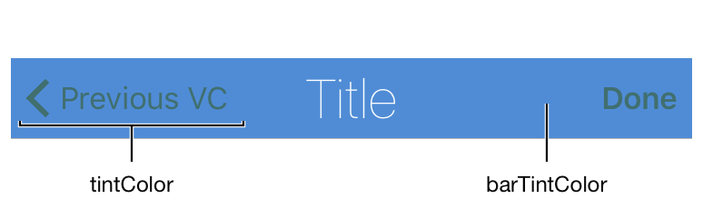
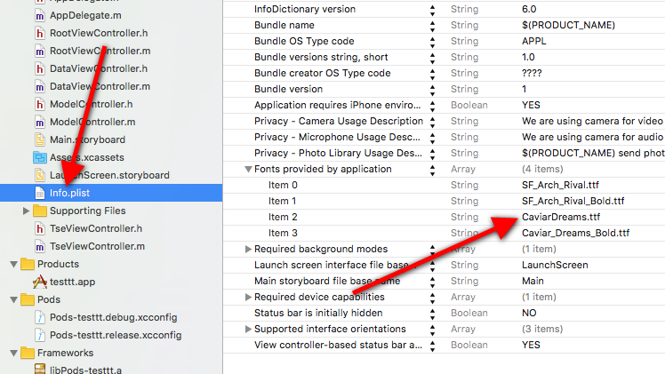
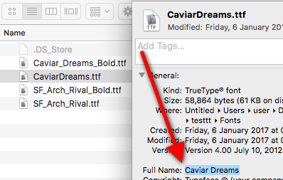
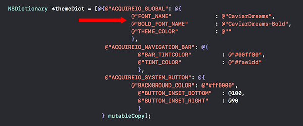
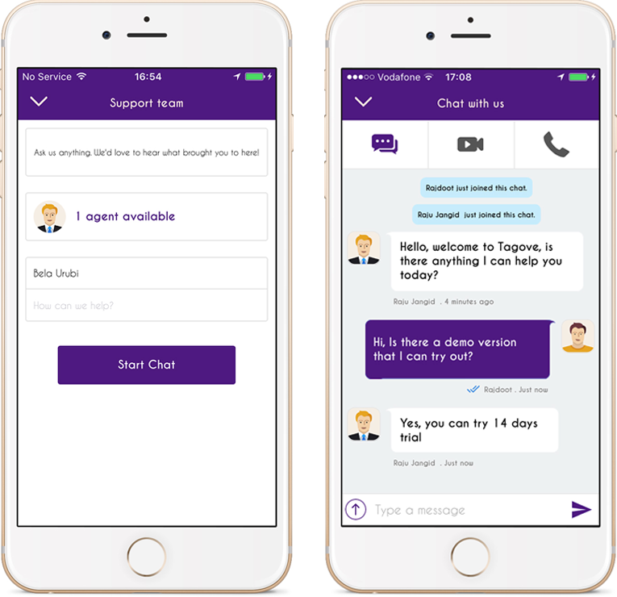

# Theme Setting


**Using UIAppearance**

UIAppearance customizations are applied to AcquireIO SDK by default. However if there is a conflicting property, then the value in `ThemeOptions` key in `AcquireIOConfig` will take precedence.

For example: If the app uses UIAppearance to change the color of Navigation Bar title and also specifies a color for the same property in the `AcquireIOConfig ThemeOptions` `NSDictionary`, then the value in dictionary will be used. In order to use the UIAppearance value, the app must leave the corresponding entry in the `ThemeOptions` blank.

if you don't want to use `AcquireIOConfig ThemeOptions` properties to SDK the use init method attribute option to '`UseDefaultTheme`' to `@YES`.




### Introduction <a id="introduction"></a>

Head over to Theming if you want to customize your SDK integration's typeface, colors or fonts. It is done via simple key-value pairs in option dictionary.

### Configuration

Check this code in \[\[AcquireIO support\] setAccount: withOptions:\]; method, where withOptions parameter is an instance of AcquireIOConfig, set options dictionary in AcquireIOConfig using:

```objectivec
NSDictionary *options = @{};
AcquireIOConfig *config = [AcquireIOConfig config];
[config setDict:options];

//Pass `config` to- setAccount: withOptions:config
```

Set NSDictionary options in format of key value. Color code will be hex value of color, start from \#. You can remove and leave blank for default theme effect. Sample format

```objectivec
NSDictionary *themeDict = [@{@"ACQUIREIO_GLOBAL": @{
                                           @"THEME_COLOR": @"#00ff00"
                                           },
                             @"ACQUIREIO_NAVIGATION_BAR": @{
                                           @"BAR_TINTCOLOR"         : @"#00ff00",
                                           @"TINT_COLOR"            : @"#fae1dd"
                                           },
                             @"ACQUIREIO_SYSTEM_BUTTON": @{
                                           @"BACKGROUND_COLOR": @"#ff0000",
                                           @"BUTTON_INSET_BOTTOM"   : @100,
                                           @"BUTTON_INSET_RIGHT"    : @90
                                           }
                                   } mutableCopy];
    
    
    
    NSDictionary *options = @{
                                ...
                             @"ThemeOptions": themeDict
                             };
```

### Theme Setting <a id="theme-setting"></a>

To skin your app, make sure you add `AcquireIOConfig @"ThemeOptions"`.

| Property | Description |
| :--- | :--- |
| `Colors` | Colors are specified in hexadecimal format, e.g. `#FFFFFF` is White. \# is required before code |
| `Fonts` | Font names should be specified by their family name & style. For example, **CaviareDreams-Bold** refers to Caviare Dreams _family_ of bold _style_. See using custom fonts section for more details |

### Global Attributes <a id="global-attributes"></a>

These attributes control the looks of in-app support over many screens.

| Property | Description |
| :--- | :--- |
| `THEME_COLOR` | Applies theme color to whole support SDK according to your app theme. Default theme color is `#3A6` |
| `FONT_NAME` | Global font face - applies to texts for sections list, Chat list, Offline form and all. Default font is system font with size according to requirement |
| `BOLD_FONT_NAME` | Applies to headers on chat screen and title of pages. Default font is system bold font with size according to requirement |

### Navigation Bar <a id="navigation-bar"></a>

| Property | Description |
| :--- | :--- |
| `BAR_STYLE` | Use `UIBarStyleBlack` or `UIBarStyleDefault`. Default bar style is `UIBarStyleDefault` |
| `BAR_TINTCOLOR` | The tint color to apply to the navigation bar background. This color is not made translucent by default unless you set the isTranslucent property to true. Default `BAR_TINTCOLOR` is `#FFFFFF` |
| `TINT_COLOR` | The tint color is navigation title and back and other bar button items color. For more see image bellow. Default color is `#000000` |

### System Button Attributes <a id="system-button-attributes"></a>

These attributes applies on default bottom right support button.

| Property | Description |
| :--- | :--- |
| `BACKGROUND_COLOR` | Applies to background color of button. Default theme color is `THEME_COLOR` |
| `BUTTON_INSET_BOTTOM` | Inset button from bottom in `NSNumber`. default bottom inset is 0. |
| `BUTTON_INSET_RIGHT` | Inset button from right in `NSNumber`. default right inset is 0. |

### System Button Badge Attributes <a id="system-button-badge-attributes"></a>

These attributes applies on default bottom right support button notification badge.

| Property | Description |
| :--- | :--- |
| `BACKGROUND_COLOR` | Applies to background color of button badge. Default color is red |
| `TEXT_COLOR` | Button badge color. Default color is `#ffffff`. |

### Using Custom Fonts <a id="using-custom-fonts"></a>

Add the font to your project. Edit your app's plist file and add a key `"Fonts provided by application"` to it. Under the key, list out file names of all the fonts you want to use in your app and in support. If you've already listed such fonts, skip this step.



**Step 2:** Copy the font's full name. To do this, select the font in Finder and hit **`COMMAND`** `⌘+I` \(Get Info\).



**Step 3:** Paste the font name into `AcquireIOConfig @"ThemeOptions" -> @"ACQUIREIO_GLOBAL" ->FONT_NAME`, wherever necessary



**Step 4:** Test the font and theme in simulator. If font couldn't load by SDK then it will show error —



### Orientation support <a id="orientation-support"></a>

By default, the iOS SDK will follow the orientation of the app.

