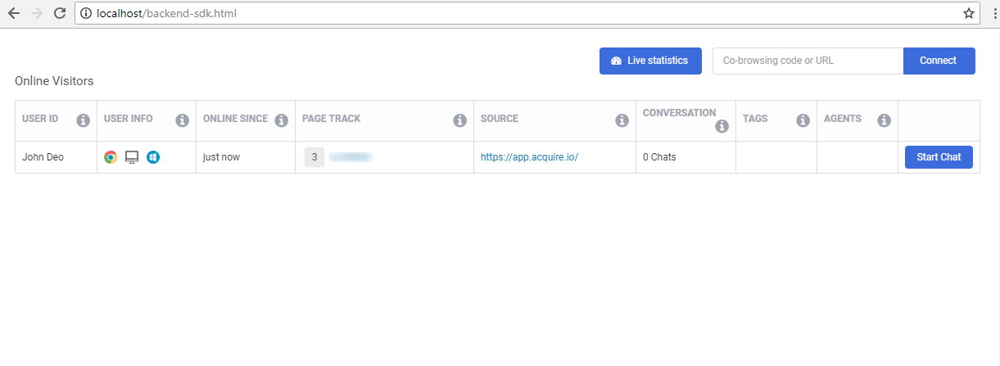

# Demo Backend SDK

If you want to load acquire full backend on any page or inside your backend then go acquire backend js sdk page \([Setup Backend JS SDK](https://developers.acquire.io/setup-backend-js-sdk)\) and setup sdk. First you'll need to load acquire script and use below acquire js code to configure SDK and indentify agent and account details so we can load full visitor list and all required parts of acquire.io to let agent handle all chats, visitor list etc.

### Step 1. Login Acquire Dashboard 

If you want to create your backend sdk then first login acquire dashboad \([app.acquire.io](https://app.acquire.io/)\). When you logged into [app.acquire.io](https://app.acquire.io/) you can see your all visitor in backend SDK.

### Step 2. Create HTML Page 

After login dashboad you create a HTML page and include sdk script `` and use backend sdk setup code \([Setup Backend JS SDK](https://developers.acquire.io/setup-backend-js-sdk)\).

### Step 3. Get ACCOUNT\_UID And Agent Details 

Acquire Dashboard in top right corner in click on profile name and  you  see ACCOUNT\_UID use this and Dashboad in open Agent menu you see here agent all datails.

### How to get Agents details using API

if you want to get all agents details use acquire agent **REST API** \([https://developer.acquire.io/rest-apis/agent](https://developer.acquire.io/rest-apis/agent) \). Agent API in you can get agents all details and make a own dashboard.

**Setup Agent API :**

Acquire agent API setup process steps:

1. first get acquire API token \([https://app.acquire.io/setting/token](https://app.acquire.io/setting/token) \) and  save in anywhere secure \(like : database\) after make functionality to get token use secure way.
2. Use **agents list** API \([https://developer.acquire.io/rest-apis/agent/agents-list](https://developer.acquire.io/rest-apis/agent/agents-list)\) for all data show in a table view.
3. If you want to create new agent use **agents add** API \([https://developer.acquire.io/rest-apis/agent/agent-add](https://developer.acquire.io/rest-apis/agent/agent-add)\) and make a form to save new agent.
4.  For edit agent details use agent edit API \( [https://developer.acquire.io/rest-apis/agent/edit-get-agent](https://developer.acquire.io/rest-apis/agent/edit-get-agent) \) . Edit API in you can get particular agent details by id and show in input.
5. After above process you use update API \([https://developer.acquire.io/rest-apis/agent/update](https://developer.acquire.io/rest-apis/agent/update)\) for edit agent's details save/ update.

### Step 4. Open HTML Page 

After all setup load HTML page in browser and see all live agents details. You can use this page as a iframe.

