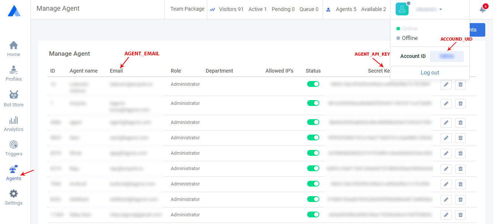

# Setup Backend JS SDK

if you want to load acquire full backend on any page or inside your backend then following sdk is what you need to setup.

First you'll need to load acquire script and use below acquire js code to configure SDK and identify agent and account details so we can load full visitor list and all required parts of acquire.io to let agent handle all chats, visitor list etc.

You won't be able to access all parts of app.acquire.io but only dashboard part, where you have real time visitor list and live statics and chats etc.

also using this sdk we'll append simple iframe inside your page, which will have funcionality and that iframe sholud be managed at your end. you can adjust that iframe's width height etc..that will be inside body element of your page.

make sure you've maximum possible width and height on iframe otherwise things may not work properly and this iframes also doesn't support responsiveness, so if your page support responsive design then inside this iframe content it won't be responsive


 &lt;script src="https://s.acquire.io/bare-backend.js"&gt;&lt;/script&gt;


```javascript
<script>
   acq_backend.load(ACCOUND_UID, AGENT_EMAIL, AGENT_API_KEY,{
      visitor_list:true, 
      // load visitors or not
      auto_close_window_on_chat_close: false, 
      // auto close window when chat close
   });
</script>
```

#### Get All Parameters

First login to acquire dashboard \( [app.acquire.io](https://app.acquire.io/)\) and open Agents. You see all agents details like : **`ACCOUND_UID`**, **`AGENT_EMAIL`**, **`AGENT_API_KEY`**



#### How to get Agents details using API

if want to get all agents details use acquire agent  **REST API**  \([https://developer.acquire.io/rest-apis/agent](https://developer.acquire.io/rest-apis/agent) \). Using Agent API you can fetch all agent details and create your own dashboard.   


 [https://developer.acquire.io/rest-apis/agent](https://developer.acquire.io/rest-apis/agent) 


#### SDK Parameters

 _**`visitor_list:true/false (default: true)`**_

This parameters tells sdk to not load visitor list, this will be helpful in case of where you want to automate few things.

_**`auto_close_window_on_chat_close :true/false (default: false)`**_

This is also helpful parameters when you are planing for some automation, suppose you open backend iframe and do something like automaic start cobrowse with visitor then you may want to close that window upon chat close, so passing true here simply means that whenver chat gets closed window will get closed too.

#### **Automatics Cobrowse**

To automate cobrowse with code, you can use following method on sdk object.

```javascript
<script>
    window.acq_backend.startCoBrowse(YOUR_CODE);
</script>
```

#### **Demo:**

When you are logged into [**app.acquire.io**](https://app.acquire.io/) you can see demo of backend integration as well for currently logged in user on following url

**Note:** This url is just for demo purpose do not use this as iframe.


[https://app.acquire.io/bare-backend.html](https://app.acquire.io/bare-backend.html)


