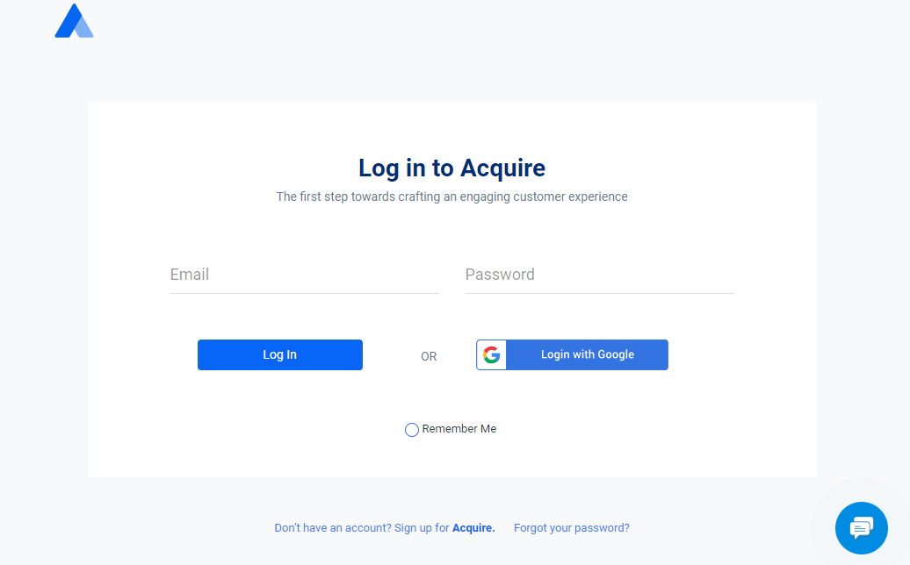

# Demo Backend SDK

If you want to load acquire full backend on any page or inside your backend then go acquire backend js sdk page \([Setup Backend JS SDK](https://developers.acquire.io/setup-backend-js-sdk)\) and setup sdk. First you'll need to load acquire script and use below acquire js code to configure SDK and indentify agent and account details so we can load full visitor list and all required parts of acquire.io to let agent handle all chats, visitor list etc.

### Step 1. Login Acquire Dashboard {#step-1--login-acquire-dashboard}

If you want to create your backend sdk then first login acquire dashboad \([app.acquire.io](https://app.acquire.io/)\). When you logged into [app.acquire.io](https://app.acquire.io/) you can see your all visitor in backend SDK.

### Step 2. Create HTML Page {#step-2--create-html-page}

After login dashboad you create a HTML page and include sdk script `` and use backend sdk setup code \([Setup Backend JS SDK](https://developers.acquire.io/setup-backend-js-sdk)\).

### Step 3. Get ACCOUNT\_UID And Agent Details {#step-3--get-account_uid-and-agent-details}

Acquire Dashboard in top right corner in click on profile name and  you  see ACCOUNT\_UID use this and Dashboad in open Agent menu you see here agent all datails.

### Step 4. Open HTML Page {#step-4--open-html-page}

After all setup load HTML page in browser and see all live agents details. You can use this page as a iframe.

