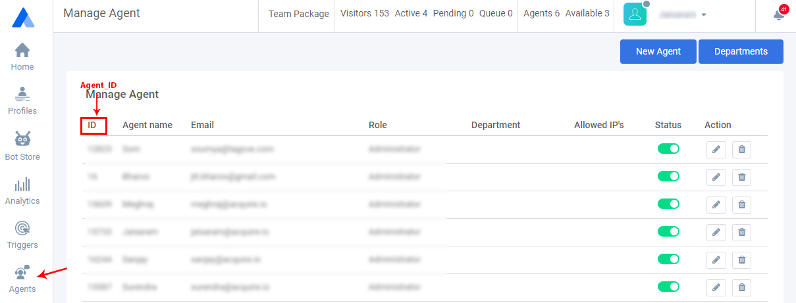

# Social Media Share

You can use these links for third-party social media like Facebook or Twitter.

Clicking on these links will automatically redirect to your website URL and start the chat.

Replace "_www.yourdomain.com_" with your website URL.

### Sample Social Share Code \( for Video Chat \)

```javascript
<a href="https://www.yourdomain.com/#start-video-chat"> Start Video Call Now </a>
```

### Sample Social Share Code \( for Audio Chat \)

```javascript
<a href="https://www.yourdomain.com/#start-audio-chat"> Get Audio Call Support </a>
```

### Sample Social Share Code \( for Text Chat \)

```javascript
<a href="https://www.yourdomain.com/#start-chat"> Start the Chat </a>
```

Replace the **`[AGENT_ID]`** with one of above agent's id and **`yourdomain.com`** with your website address where you use chat box.

#### Get AGENT\_ID

First login Acquire dashboard and open **`Agents`** and copy specific **`agent ID`**.



### Social Share Code \( for Text Chat \)

```javascript
<a href="https://www.yourdomain.com/#start-chat-a[AGENT_ID]">Start the Chat</a>
```

#### Example:

```javascript
<a href="https://www.yourdomain.com/#start-chat-a12823">Start the Chat With Som</a>
```

### Social Share Code \( for Audio Call \)

```javascript
<a href="https://www.yourdomain.com/#start-audio-chat-a[AGENT_ID]">Start the Chat</a>
```

#### Example:

```javascript
<a href="https://www.yourdomain.com/#start-audio-chat-a12823">Start the Chat With Som</a>
```

### Social Share Code \( for Video Call \)

```javascript
<a href="https://www.yourdomain.com/#start-video-chat-a[AGENT_ID]">Start the Chat</a>
```

#### Example:

```javascript
<a href="https://www.yourdomain.com/#start-video-chat-a12823">Start the Chat With Som</a>
```


