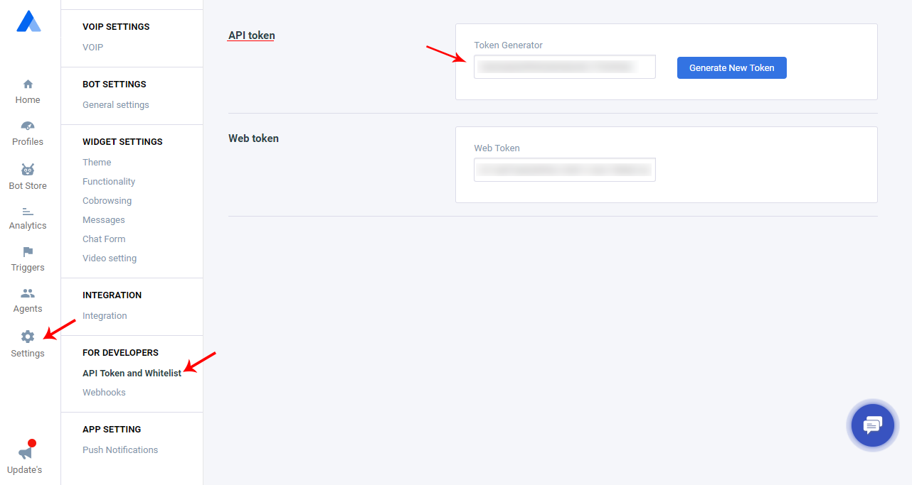
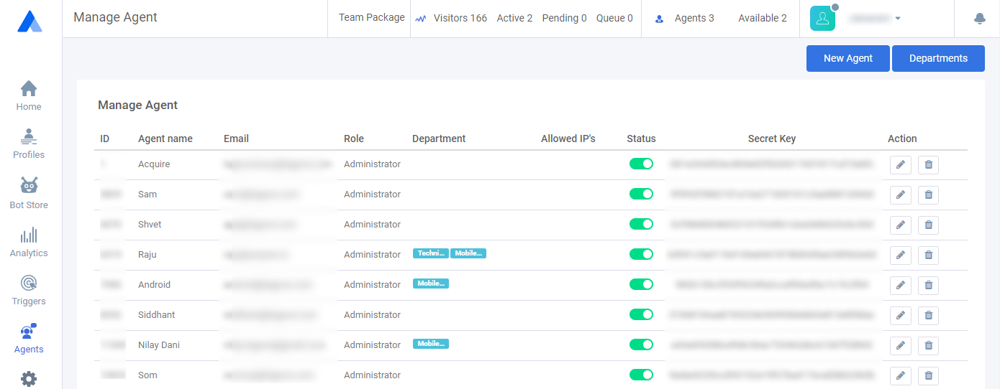

# Agents List

Using acquire agent API for agents all details and get activities. You can do setup acquire backend on your own dashboard easily use this. Agent List API in all agents details available. Acquire Agent List API in you can get agent's **`'secret_key'`** and use anywhere but make sure secure this.

#### **Get Auth Token**

We provide an Access Token as soon as you create an app on your workspace. First login Acquire dashboard and Go **Setting &gt; API Token and Whitelist &gt; API Token** \( [https://app.acquire.io/setting/token](https://app.acquire.io/setting/token) \). Copy API token and use API header in **`auth_token`** parameter. If you want to new token generate click on button "**Generate New Token**".



Your Access Token can give access to your private Acquire data and should be treated like a password. **If an app provider asks you for your Access Token, please do not provide it. Instead, let us know - apps are required to use OAuth rather than asking users for Access Tokens.**


 **API auth token  \[YOUR\_API\_AUTH\_TOKEN\]  do not use  public and make sure secure.**  



If you want to use auth token in API for makes a own dashboard then save anywhere and use server side.





| Parameter | Value |
| :--- | :--- |
| **Path** | https://app.acquire.io/account/agents |
| **Method** | POST |
| **Authorization**  | **Bearer \[YOUR\_API\_AUTH\_TOKEN\]** |
| **Content-type** | application/x-www-form-urlencoded |

#### **Body \(**formdata**\)**

| Parameter | Value |
| :--- | :--- |
| **page** | 1 |
| **limit** | 10 |

#### **Response JSON**

```javascript

{
    "success": true,
    "error": null,
    "data": {
        "rows": [
            {
                "id": 5128,
                "user_id": 3518,
                "account_id": 4574,
                "user_name": "Devid",
                "user_email": "devidklok@acquire.io",
                "allowed_ip": "",
                "user_role_id": 1,
                "role_name": "Administrator",
                "role_status": "active",
                "user_status": "active",
                "secret_key": "[AGENT_SECRET_KEY]",
                "department_id": null,
                "department_name": null
            }
        ],
        "count": 1,
        "page": 1,
        "limit": 10
    }
}

```

#### **Sample Code**



```javascript
$curl = curl_init();

	curl_setopt_array($curl, array(
		CURLOPT_URL => "https://app.acquire.io/account/agents",
		CURLOPT_RETURNTRANSFER => true,
		CURLOPT_ENCODING => "",
		CURLOPT_MAXREDIRS => 10,
		CURLOPT_TIMEOUT => 30,
		CURLOPT_HTTP_VERSION => CURL_HTTP_VERSION_1_1,
		CURLOPT_CUSTOMREQUEST => "POST",
		CURLOPT_POSTFIELDS => "------WebKitFormBoundary7MA4YWxkTrZu0gW\r\nContent-Disposition: form-data;
			name=\"page\"\r\n\r\n1\r\n------WebKitFormBoundary7MA4YWxkTrZu0gW\r\nContent-Disposition: form-data;
			name=\"limit\"\r\n\r\n10\r\n------WebKitFormBoundary7MA4YWxkTrZu0gW--",
		CURLOPT_HTTPHEADER => array(
		"Content-Type: application/x-www-form-urlencoded",
		"content-type: multipart/form-data; boundary=----WebKitFormBoundary7MA4YWxkTrZu0gW"
		),
	));

	$response = curl_exec($curl);
	$err = curl_error($curl);

	curl_close($curl);

	if ($err) {
		echo "cURL Error #:" . $err;
	} else {
		echo $response;
	}
```



```javascript
 require 'uri'
	require 'net/http'

	url = URI("https://app.acquire.io/account/agents")

	http = Net::HTTP.new(url.host, url.port)

	request = Net::HTTP::Post.new(url)
	request["Content-Type"] = 'application/x-www-form-urlencoded'
	request.body = "------WebKitFormBoundary7MA4YWxkTrZu0gW\r\nContent-Disposition: form-data;
					name=\"page\"\r\n\r\n1\r\n------WebKitFormBoundary7MA4YWxkTrZu0gW\r\nContent-Disposition: form-data;
					name=\"limit\"\r\n\r\n10\r\n------WebKitFormBoundary7MA4YWxkTrZu0gW--"

	response = http.request(request)
	puts response.read_body

```



```javascript
curl --request POST \
		--url 'https://app.acquire.io/account/agents' \
		--header 'Content-Type: application/x-www-form-urlencoded' \
		--header 'content-type: multipart/form-data; boundary=----WebKitFormBoundary7MA4YWxkTrZu0gW' \
		--form page=1 \
		--form limit=10
```



```javascript
 var form = new FormData();
		form.append("page", "1");
		form.append("limit", "10");

	var settings = {
		"async": true,
		"crossDomain": true,
		"url": "https://app.acquire.io/account/agents",
		"method": "POST",
		"headers": {
		"Content-Type": "application/x-www-form-urlencoded"
	},
		"processData": false,
		"contentType": false,
		"mimeType": "multipart/form-data",
		"data": form
	}
	$.ajax(settings).done(function (response) {
	console.log(response);
	});
```



```javascript
import requests

	url = "https://app.acquire.io/account/agents"

	payload = "------WebKitFormBoundary7MA4YWxkTrZu0gW\r\nContent-Disposition: form-data;
			name=\"page\"\r\n\r\n1\r\n------WebKitFormBoundary7MA4YWxkTrZu0gW\r\nContent-Disposition: form-data;
			name=\"limit\"\r\n\r\n10\r\n------WebKitFormBoundary7MA4YWxkTrZu0gW--"
	headers = {'Content-Type': 'application/x-www-form-urlencoded'}

	response = requests.request("POST", url, data=payload, headers=headers)

	print(response.text)
```



```javascript
var http = require("http");

	var options = {
		"method": "POST",
		"hostname": [
		    "app",
			"acquire",
			"io"
	],
	"path": [
		"account",
		"agents"
	],
	"headers": {
		"Content-Type": "application/x-www-form-urlencoded"
		}
	};

	var req = http.request(options, function (res) {
	var chunks = [];

	res.on("data", function (chunk) {
		chunks.push(chunk);
	});

	res.on("end", function () {
		var body = Buffer.concat(chunks);
		console.log(body.toString());
		});
	});

	req.write("------WebKitFormBoundary7MA4YWxkTrZu0gW\r\nContent-Disposition: form-data;
		name=\"page\"\r\n\r\n1\r\n------WebKitFormBoundary7MA4YWxkTrZu0gW\r\nContent-Disposition: form-data;
		name=\"limit\"\r\n\r\n10\r\n------WebKitFormBoundary7MA4YWxkTrZu0gW--");
	req.end();
```




