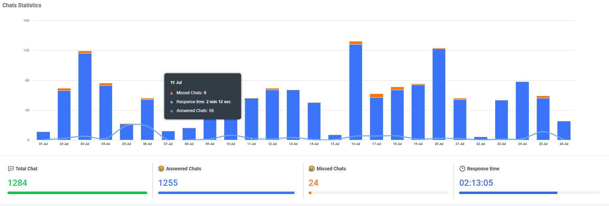
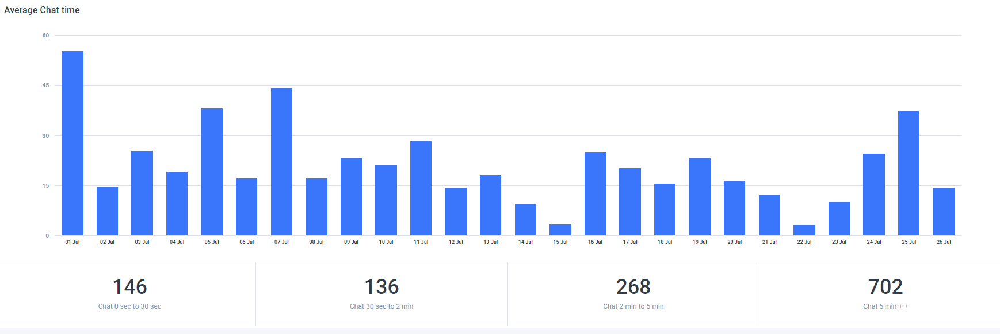
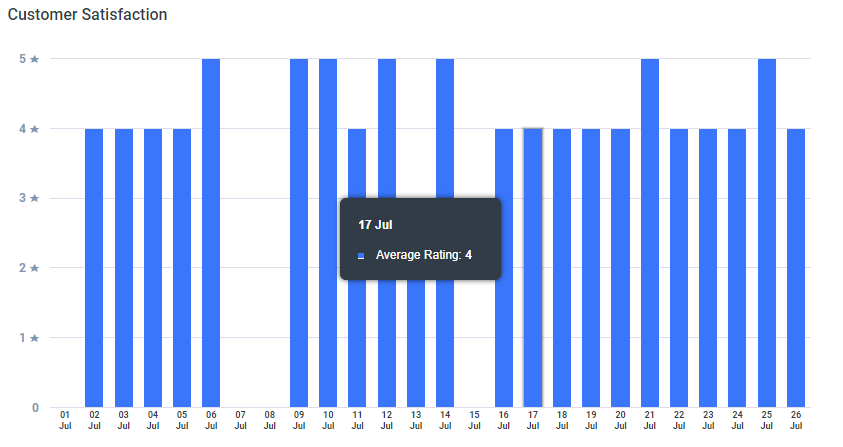

# Chat Statistics

Acquire live chat dashboard gives your team leader an overview of agent activity at any given time. Your all chat data reports get and view in this API and you see data Today, Yesterday, daily, weekly and monthly parameter in multiple ways like this: Chats Statistics, Average Chat time, Conversion Rate etc.

Chat Statistics api parameter in Select your timezone, date start, date end, and filter\_type. Filter Type in today, yesterday, daily, weekly and monthly parameter available.

**Chat Statistic**



**Average Chat tim**



**Customer Satisfactio**



| Parameter | Value |
| :--- | :--- |
| **Path** | https://app.acquire.io/api/analytics/general/chat-statistics |
| **Method** | POST |
| **Authorization** | Bearer \[YOUR\_API\_AUTH\_TOKEN\] |
| **Content-type** | application/x-www-form-urlencoded |

**Body**

| Parameter | Value |
| :--- | :--- |
| **timezone** | Europe/London |
| **date\_start** | 2018-08-25 00:00:00 |
| **date\_end** | 2018-09-3 23:59:59 |
| **filter\_type** | daily |

**Response JSON**

```javascript

{
    "success": true,
    "error": null,
    "data": {
        "chat_statistics": {
            "graph_row": {
                "chat_date": [
                    "25 Aug",
                    "26 Aug",
                    "27 Aug",
                    "28 Aug",
                    "29 Aug",
                    "30 Aug",
                    "31 Aug",
                    "01 Sep",
                    "02 Sep",
                    "03 Sep"
                ],
                "chat_answered": [
                    13,
                    2,
                    49,
                    83,
                    37,
                    45,
                    48,
                    27,
                    0,
                    11
                ],
                "chat_missed": [
                    10,
                    0,
                    11,
                    7,
                    3,
                    8,
                    2,
                    0,
                    0,
                    1
                ],
                "chat_total": [
                    23,
                    4,
                    63,
                    90,
                    42,
                    53,
                    52,
                    29,
                    0,
                    12
                ],
                "chat_response_time": [
                    0.5,
                    0.1,
                    1.23,
                    0.15,
                    0.14,
                    0.22,
                    0.21,
                    9.4,
                    0,
                    0.17
                ],
                "resp_avg": [
                    1.44,
                    12.21,
                    5.51,
                    10.27,
                    17.34,
                    14.28,
                    26.33,
                    5.47,
                    0,
                    4.1
                ],
                "rating_total": [
                    3,
                    0,
                    5,
                    2,
                    2,
                    5,
                    5,
                    4,
                    0,
                    1
                ],
                "rating_avg": [
                    5,
                    0,
                    4,
                    4,
                    4,
                    4,
                    5,
                    5,
                    0,
                    4
                ],
                "rating_1": [
                    0,
                    0,
                    1,
                    0,
                    0,
                    0,
                    0,
                    0,
                    0,
                    0
                ],
                "rating_2": [
                    0,
                    0,
                    0,
                    0,
                    0,
                    1,
                    0,
                    0,
                    0,
                    0
                ],
                "rating_3": [
                    0,
                    0,
                    0,
                    0,
                    1,
                    0,
                    0,
                    0,
                    0,
                    0
                ],
                "rating_4": [
                    1,
                    0,
                    0,
                    2,
                    0,
                    2,
                    1,
                    0,
                    0,
                    1
                ],
                "rating_5": [
                    2,
                    0,
                    4,
                    0,
                    1,
                    2,
                    4,
                    4,
                    0,
                    0
                ]
            },
            "total_res_time": "00:01:05",
            "total_chat": 368,
            "total_answered": 315,
            "total_missed": 42,
            "zero_thirty": 64,
            "thirty_two_min": 44,
            "two_five_min": 55,
            "five_plus": 148
        }
    }
}

```

**Sample Code**



```javascript
$curl = curl_init();

	curl_setopt_array($curl, array(
		CURLOPT_URL => "https://app.acquire.io/analytics/general/chat-statistics",
		CURLOPT_RETURNTRANSFER => true,
		CURLOPT_ENCODING => "",
		CURLOPT_MAXREDIRS => 10,
		CURLOPT_TIMEOUT => 30,
		CURLOPT_HTTP_VERSION => CURL_HTTP_VERSION_1_1,
		CURLOPT_CUSTOMREQUEST => "POST",
		CURLOPT_POSTFIELDS => "timezone=Europe%2FLondon&date_start=2018-08-25%2000%3A00%3A00&date_end=2018-09-03%2023%3A59%3A59&filter_type=",
		CURLOPT_HTTPHEADER => array(
		"Authorization: Bearer [YOUR_API_AUTH_TOKEN]",
		"Content-Type: application/x-www-form-urlencoded"
		),
	));

	$response = curl_exec($curl);
	$err = curl_error($curl);

	curl_close($curl);

	if ($err) {
		echo "cURL Error #:" . $err;
	} else {
		echo $response;
	}
```



```javascript
require 'uri'
	require 'net/http'

		url = URI("https://app.acquire.io/analytics/general/chat-statistics")

		http = Net::HTTP.new(url.host, url.port)

	request = Net::HTTP::Post.new(url)
	request["Authorization"] = 'Bearer [YOUR_API_AUTH_TOKEN]'
	request["Content-Type"] = 'application/x-www-form-urlencoded'
	request.body = "timezone=Europe%2FLondon&date_start=2018-08-25%2000%3A00%3A00&date_end=2018-09-03%2023%3A59%3A59&filter_type="

	response = http.request(request)
	puts response.read_body
```



```javascript
curl --request POST \
		--url 'https://app.acquire.io/analytics/general/chat-statistics' \
		--header 'Authorization: Bearer [YOUR_API_AUTH_TOKEN]' \
		--header 'Content-Type: application/x-www-form-urlencoded' \
		--data 'timezone=Europe%2FLondon&date_start=2018-08-25%2000%3A00%3A00&date_end=2018-09-03%2023%3A59%3A59&filter_type='
```



```javascript
var settings = {
		"async": true,
		"crossDomain": true,
		"url": "https://app.acquire.io/analytics/general/chat-statistics",
		"method": "POST",
		"headers": {
		"Authorization": "Bearer [YOUR_API_AUTH_TOKEN]",
		"Content-Type": "application/x-www-form-urlencoded"
	},
		"data": {
			"timezone": "Europe/London",
			"date_start": "2018-08-25 00:00:00",
			"date_end": "2018-09-03 23:59:59"
		}
	}

	$.ajax(settings).done(function (response) {
		console.log(response);
	});
```



```javascript
import requests

		url = "https://app.acquire.io/analytics/general/chat-statistics"

		payload = "timezone=Europe%2FLondon&date_start=2018-08-25%2000%3A00%3A00&date_end=2018-09-03%2023%3A59%3A59&filter_type="
		headers = {'Authorization':'Bearer [YOUR_API_AUTH_TOKEN]','Content-Type': 'application/x-www-form-urlencoded'}

		response = requests.request("POST", url, data=payload, headers=headers)

	print(response.text)
```



```javascript
var qs = require("querystring");
	var http = require("http");

	var options = {
		"method": "POST",
		"hostname": [
			"app",
			"acquire",
			"io"
		],
		"path": [
		"analytics",
		"general",
		"chat-statistics"
		],
		"headers": {
			"Authorization": "Bearer [YOUR_API_AUTH_TOKEN]",
			"Content-Type": "application/x-www-form-urlencoded"
		}
	};

	var req = http.request(options, function (res) {
	var chunks = [];

	res.on("data", function (chunk) {
		chunks.push(chunk);
	});

	res.on("end", function () {
		var body = Buffer.concat(chunks);
		console.log(body.toString());
		});
	});

	req.write(qs.stringify({ timezone: 'Europe/London',
		date_start: '2018-08-25 00:00:00',
		date_end: '2018-09-03 23:59:59',
		filter_type: undefined }));
	req.end();
```



