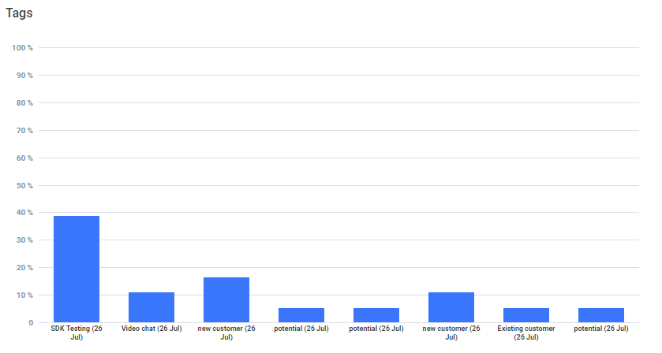

# Chat Tag

Acquire live chat dashboard gives your team leader an overview of agent activity at any given time.

Chat Tag API body parameter in add your timezone, date start, date end and filter\_type. Filter Type in today, yesterday, daily, weekly and monthly parameter available.

**Chat Tag**



| Parameter | Value |
| :--- | :--- |
| **Path** | https://app.acquire.io/analytics/general/chat-tag |
| **Method** | POST |
| **Authorization** | Bearer \[YOUR\_API\_AUTH\_TOKEN\] |
| **Content-type** | application/x-www-form-urlencoded |

**Body**

| Parameter | Value |
| :--- | :--- |
| **timezone** | Europe/London |
| **date\_start** | 2018-05-23 00:00:00 |
| **date\_end** | 2018-07-18 23:59:59 |
| **filter\_type** | daily |

**Response JSON**

```javascript

{
    "success": true,
    "error": null,
    "data": {
        "chat_tag": {
            "total": {
                "tag_name": [
                    "new customer (03 Sep)",
                    "new customer (03 Sep)",
                    "Support (03 Sep)",
                    "Support (03 Sep)",
                    "Existing customer  (03 Sep)",
                    "Support (03 Sep)",
                    "new customer (03 Sep)",
                    "Existing customer  (03 Sep)"
                ],
                "total_tag": [
                    2.7,
                    5.41,
                    2.7,
                    2.7,
                    13.51,
                    5.41,
                    8.11,
                    2.7
                ]
            }
        }
    }
}

```

**Sample Code**



```javascript
 $curl = curl_init();

	curl_setopt_array($curl, array(
		CURLOPT_URL => "https://app.acquire.io/analytics/general/chat-tag",
		CURLOPT_RETURNTRANSFER => true,
		CURLOPT_ENCODING => "",
		CURLOPT_MAXREDIRS => 10,
		CURLOPT_TIMEOUT => 30,
		CURLOPT_HTTP_VERSION => CURL_HTTP_VERSION_1_1,
		CURLOPT_CUSTOMREQUEST => "POST",
		CURLOPT_POSTFIELDS => "timezone=Europe%2FLondon&date_start=2018-05-23%2000%3A00%3A00&date_end=2018-07-18%2023%3A59%3A59&filter_type=",
		CURLOPT_HTTPHEADER => array(
			"Authorization: Bearer [YOUR_API_AUTH_TOKEN]",
			"Content-Type: application/x-www-form-urlencoded"
		),
	));

	$response = curl_exec($curl);
	$err = curl_error($curl);

	curl_close($curl);

	if ($err) {
		echo "cURL Error #:" . $err;
	} else {
		echo $response;
	}
```



```javascript
require 'uri'
	require 'net/http'

	url = URI("https://app.acquire.io/analytics/general/chat-tag")

	http = Net::HTTP.new(url.host, url.port)

	request = Net::HTTP::Post.new(url)
	request["Authorization"] = 'Bearer [YOUR_API_AUTH_TOKEN]'
	request["Content-Type"] = 'application/x-www-form-urlencoded'
	request.body = "timezone=Europe%2FLondon&date_start=2018-05-23%2000%3A00%3A00&date_end=2018-07-18%2023%3A59%3A59&filter_type="

	response = http.request(request)
	puts response.read_body
```



```text
curl --request POST \
		--url 'https://app.acquire.io/analytics/general/chat-tag' \
		--header 'Authorization: Bearer [YOUR_API_AUTH_TOKEN]' \
		--header 'Content-Type: application/x-www-form-urlencoded' \
		--data 'timezone=Europe%2FLondon&date_start=2018-05-23%2000%3A00%3A00&date_end=2018-07-18%2023%3A59%3A59&filter_type='
```



```javascript
var settings = {
	"async": true,
	"crossDomain": true,
	"url": "https://app.acquire.io/analytics/general/chat-tag",
	"method": "POST",
	"headers": {
		"Authorization": "Bearer [YOUR_API_AUTH_TOKEN]",
		"Content-Type": "application/x-www-form-urlencoded"
	},
	"data": {
		"timezone": "Europe/London",
		"date_start": "2018-05-23 00:00:00",
		"date_end": "2018-07-18 23:59:59"
	}
	}

	$.ajax(settings).done(function (response) {
		console.log(response);
	});
```



```javascript
import requests

		url = "https://app.acquire.io/analytics/general/chat-tag"

		payload = "timezone=Europe%2FLondon&date_start=2018-05-23%2000%3A00%3A00&date_end=2018-07-18%2023%3A59%3A59&filter_type="
		headers = {'Authorization': 'Bearer [YOUR_API_AUTH_TOKEN]'}
		headers = {'Content-Type': 'application/x-www-form-urlencoded'}

		response = requests.request("POST", url, data=payload, headers=headers)

	print(response.text)
```



```javascript
 var qs = require("querystring");
	var http = require("http");

	var options = {
		"method": "POST",
		"hostname": [
			"app",
			"acquire",
			"io"
		],
		"path": [
		"analytics",
		"general",
		"chat-tag"
		],
		"headers": {
			"Authorization": "Bearer [YOUR_API_AUTH_TOKEN]",
			"Content-Type": "application/x-www-form-urlencoded"
		}
	};

	var req = http.request(options, function (res) {
	var chunks = [];

	res.on("data", function (chunk) {
		chunks.push(chunk);
	});

	res.on("end", function () {
		var body = Buffer.concat(chunks);
		console.log(body.toString());
	});
	});

	req.write(qs.stringify({ timezone: 'Europe/London',
		date_start: '2018-05-23 00:00:00',
		date_end: '2018-07-18 23:59:59',
		filter_type: undefined }));
	req.end();
```



