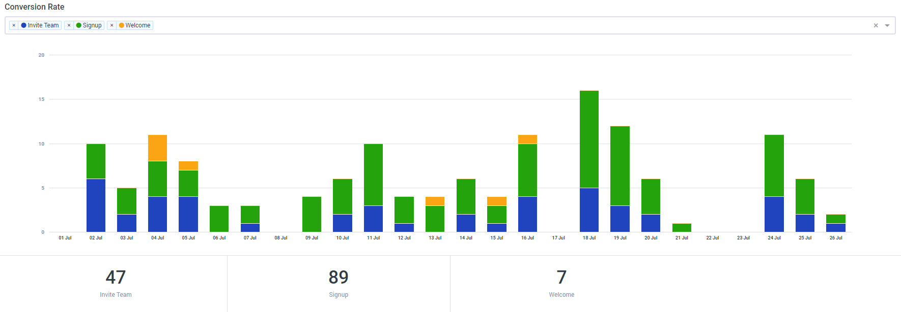

# Conversion Rate

Acquire live chat dashboard gives your team leader an overview of agent activity at any given time.

Conversion Rate API parameter in add your timezone, date start, date end, filter\_type and conversion. Filter Type in today, yesterday, daily, weekly and monthly parameter available.

**Conversion Rat**



| Parameter | Value |
| :--- | :--- |
| **Path** | https://app.acquire.io/analytics/general/conversion-rate |
| **Method** | POST |
| **Authorization** | Bearer \[YOUR\_API\_AUTH\_TOKEN\] |
| **Content-type** | application/x-www-form-urlencoded |

**Body**

| Parameter | Value |
| :--- | :--- |
| **timezone** | Europe/London |
| **date\_start** | 2018-05-23 00:00:00 |
| **date\_end** | 2018-07-18 23:59:59 |
| **filter\_type** | daily |
| **conversion** |  |

#### **Response JSON**

```javascript

{
    "success": true,
    "error": null,
    "data": {
        "conversion_rate": {
            "label": [],
            "tracked": [],
            "total": [],
            "list": [
                {
                    "id": 43,
                    "name": "Invite Team"
                },
                {
                    "id": 42,
                    "name": "Signup"
                },
                {
                    "id": 44,
                    "name": "Welcome"
                }
            ]
        }
    }
}

```

#### **Sample Code**



```javascript
$curl = curl_init();

	curl_setopt_array($curl, array(
		CURLOPT_URL => "https://app.acquire.io/analytics/general/conversion-rate",
		CURLOPT_RETURNTRANSFER => true,
		CURLOPT_ENCODING => "",
		CURLOPT_MAXREDIRS => 10,
		CURLOPT_TIMEOUT => 30,
		CURLOPT_HTTP_VERSION => CURL_HTTP_VERSION_1_1,
		CURLOPT_CUSTOMREQUEST => "POST",
		CURLOPT_POSTFIELDS => "timezone=Europe%2FLondon&date_start=2018-05-23%2000%3A00%3A00&date_end=2018-07-18%2023%3A59%3A59&filter_type=&conversion=",
	CURLOPT_HTTPHEADER => array(
		"Authorization: Bearer [YOUR_API_AUTH_TOKEN]",
		"Content-Type: application/x-www-form-urlencoded"
	),
	));

	$response = curl_exec($curl);
	$err = curl_error($curl);

	curl_close($curl);

	if ($err) {
		echo "cURL Error #:" . $err;
	} else {
		echo $response;
	}
```



```javascript
 require 'uri'
	require 'net/http'

	url = URI("https://app.acquire.io/analytics/general/conversion-rate")

	http = Net::HTTP.new(url.host, url.port)

	request = Net::HTTP::Post.new(url)
	request["Authorization"] = 'Bearer [YOUR_API_AUTH_TOKEN]'
	request["Content-Type"] = 'application/x-www-form-urlencoded'
	request.body = "timezone=Europe%2FLondon&date_start=2018-05-23%2000%3A00%3A00&date_end=2018-07-18%2023%3A59%3A59&filter_type=&conversion="

	response = http.request(request)
	puts response.read_body
```



```javascript
 curl --request POST \
		--url 'https://app.acquire.io/analytics/general/conversion-rate' \
		--header 'Authorization: Bearer [YOUR_API_AUTH_TOKEN]' \
		--header 'Content-Type: application/x-www-form-urlencoded' \
		--data 'timezone=Europe%2FLondon&date_start=2018-05-23%2000%3A00%3A00&date_end=2018-07-18%2023%3A59%3A59&filter_type=&conversion='
```



```javascript
var settings = {
		"async": true,
		"crossDomain": true,
		"url": "https://app.acquire.io/analytics/general/conversion-rate",
		"method": "POST",
		"headers": {
			"Authorization": "Bearer [YOUR_API_AUTH_TOKEN]",
			"Content-Type": "application/x-www-form-urlencoded"
		},
		"data": {
			"timezone": "Europe%2FLondon",
			"date_start": "2018-05-23 00:00:00",
			"date_end": "2018-07-18 23:59:59",
			"conversion": ""
		}
	}

	$.ajax(settings).done(function (response) {
		console.log(response);
	});
```



```javascript
 import requests

		url = "https://app.acquire.io/analytics/general/conversion-rate"

		payload = "timezone=Europe%2FLondon&date_start=2018-05-23%2000%3A00%3A00&date_end=2018-07-18%2023%3A59%3A59&filter_type=&conversion="
		headers = {'Authorization': 'Bearer [YOUR_API_AUTH_TOKEN]','Content-Type': 'application/x-www-form-urlencoded'}

		response = requests.request("POST", url, data=payload, headers=headers)

	print(response.text)

```



```javascript
 var qs = require("querystring");
	var http = require("http");

	var options = {
		"method": "POST",
		"hostname": [
			"app",
			"acquire",
			"io"
		],
		"path": [
			"analytics",
			"general",
			"conversion-rate"
		],
		"headers": {
			"Authorization": "Bearer [YOUR_API_AUTH_TOKEN]",
			"Content-Type": "application/x-www-form-urlencoded"
		}
	};

	var req = http.request(options, function (res) {
	var chunks = [];

	res.on("data", function (chunk) {
		chunks.push(chunk);
	});

	res.on("end", function () {
		var body = Buffer.concat(chunks);
		console.log(body.toString());
		});
	});

	req.write(qs.stringify({ timezone: 'Europe/London',
		date_start: '2018-05-23 00:00:00',
		date_end: '2018-07-18 23:59:59',
		filter_type: undefined,
		conversion: '' }));
	req.end();
```



