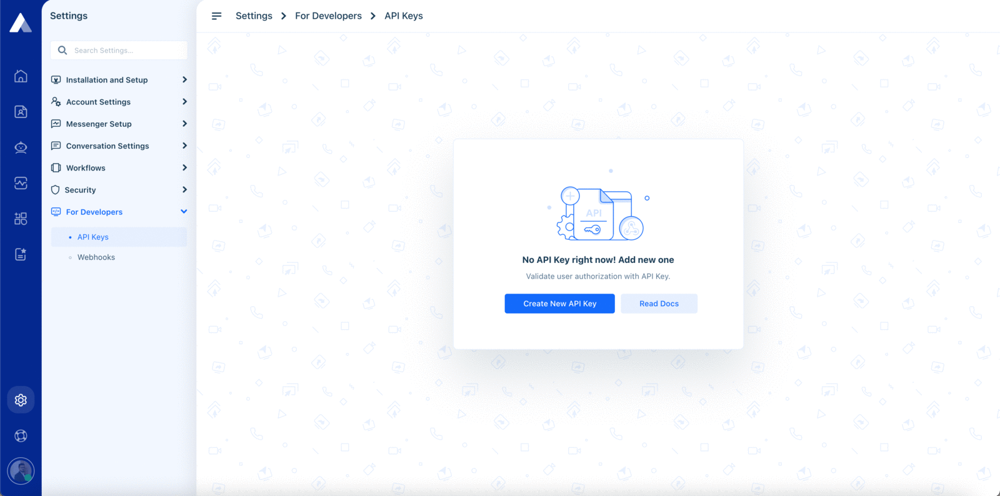

# Authorization

All requests to Acquire’s APIs require you to authenticate with an **API\_KEY**. Authentication is provided by API KEY. These API keys can be generated from the settings. You are able to manage API keys through the UI, by logging into the Acquire account and managing the API key there. Here is an example of the API Key dashboard in the settings.**`Settings > For Developers > API Key`**  
  
**Authentication example**  
Include this HTTP header for each API request:

`Authorization: Bearer ${API_KEY}`

**Header Name:** Authorization  
**Header Value:** Bearer {{API\_KEY}}

Note: _Please make sure there is a space between the Bearer and API KEY._

### **How to get an API\_KEY**


Make sure that you must have the necessary **API key** to generate permission.


1. Login to your Acquire account.
2. Navigate to Settings &gt; For Developers &gt; API Key.
3. Click on **Create API Key** button  

We provide an Access Token as soon as you create an app on your workspace. First login Acquire dashboard and Go **`Settings > For Developers > API Key`**. Copy API token and use api header in auth\_token parameter. If you want to new token generate click on button "**Generate New Token**".



**API\_KEY** allows you to engage the Acquire data and should be treated like a password. If an app provider asks you for your Access Token, please do not provide it. Instead, let us know - apps are required to use OAuth rather than asking users for Access Tokens.


#### Save Your API\_KEY

There is no way to re-display **API\_KEY** after generating done, so be sure to securely store the **API\_KEY** before exiting this screen.



All API requests must be over HTTPS. 


### **Sample Code**

```javascript
curl --request GET 'https://{{account_id}}.acquire.io/api/v1/account/department' \
--header 'Authorization: Bearer ${API_KEY}'
```

