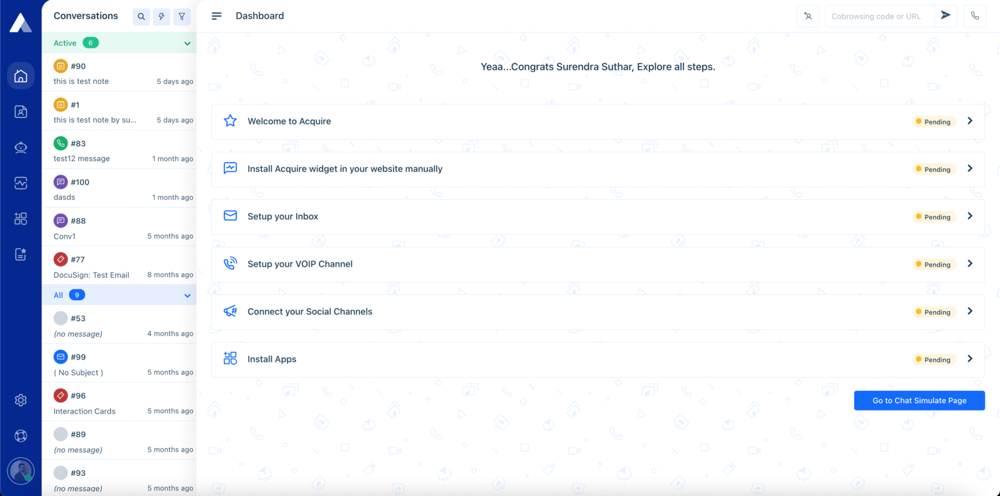

# Authorization

All requests to Acquire’s APIs require you to authenticate with an **API\_KEY**. Authentication is provided by API KEY. These API keys can be generated from the settings. You are able to manage API keys through the UI, by logging into the Acquire account and managing the API key there. Here is an example of the API Key dashboard in the settings.**`Settings > For Developers > API Key`**  
  
**Authentication example**  
Include this HTTP header for each API request:

`Authorization: Bearer ${API_KEY}`

**Header Name:** Authorization  
**Header Value:** Bearer {{API\_KEY}}

Note: _Please make sure there is a space between the Bearer and API KEY._

### **Sample Code**

```javascript
curl --request GET 'https://{{account_id}}.acquire.io/api/v1/account/department' \
--header 'Authorization: Bearer ${API_KEY}'
```

### **How to get an API\_KEY**


Make sure that you must have the necessary **API key** to generate permission.


The Following steps to generate API\_KEY.

1. Login to your Acquire account.
2. Navigate to `Settings > For Developers > API Key`.
3. Click on **Create API Key** button and enter a token name, token select permission.
4. Click on the Next button, you will get **Token Generated.**
5. Copy Generated Token and securely store it, Generated Token will not re-display.
6. Done, Close the popup.



#### Save Your API\_KEY

There is no way to re-display **API\_KEY** after generating done, so be sure to securely store the **API\_KEY** before exiting this screen.



All API requests must be over HTTPS. 


### Revoking Generated API KEY __

Following steps to revoke API Key

1. Login to your Acquire account.
2. Navigate to `Settings > For Developers > API Key`
3. In the Action column click on the action menu on the Manage API key dashboard, click the delete button.
4. Delete API KEY confirmation popup will display and click **Delete API Key.**




### Delete Carefully

Deleting an API KEY cannot be undone, so be sure to click the **Delete API Key**. 


