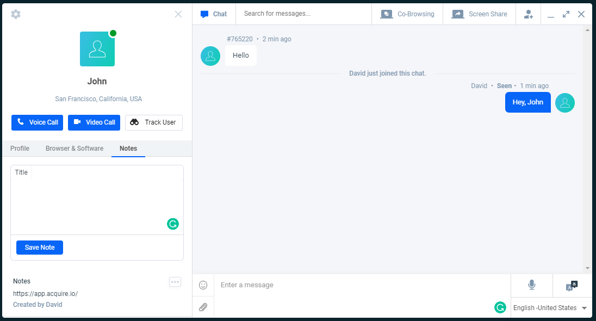

# Chat Notes

Acquire live chat in you can use chat notes while chatting with visitor and chat notes API in you can get all notes. Chat Notes API in body parameter in pass chat\_id and header in pass Authentication token \( [https://app.acquire.io/setting/token](https://app.acquire.io/setting/token) \).

**Chat Notes**




| Parameter | Value |
| :--- | :--- |
| **Path** | https://app.acquire.io/ api/chat/notes |
| **Method** | POST |
| **Authorization** | Bearer **\[YOUR\_API\_AUTH\_TOKEN\]** |
| **Content-type** | application/x-www-form-urlencoded |
|  |  |

#### **Body \(urlencoded\)**

| Parameter | Value |
| :--- | :--- |
| chat\_id | 761160 |

#### Response JSON 

```javascript
{
    "success": true,
    "error": null,
    "data": [
        {
            "id": 393,
            "user_id": 15401,
            "title": "Note",
            "content": "https://app.acquire.io/",
            "date_created": "2019-01-18 09:35:31",
            "date_updated": null
        }
    ]
}
```


