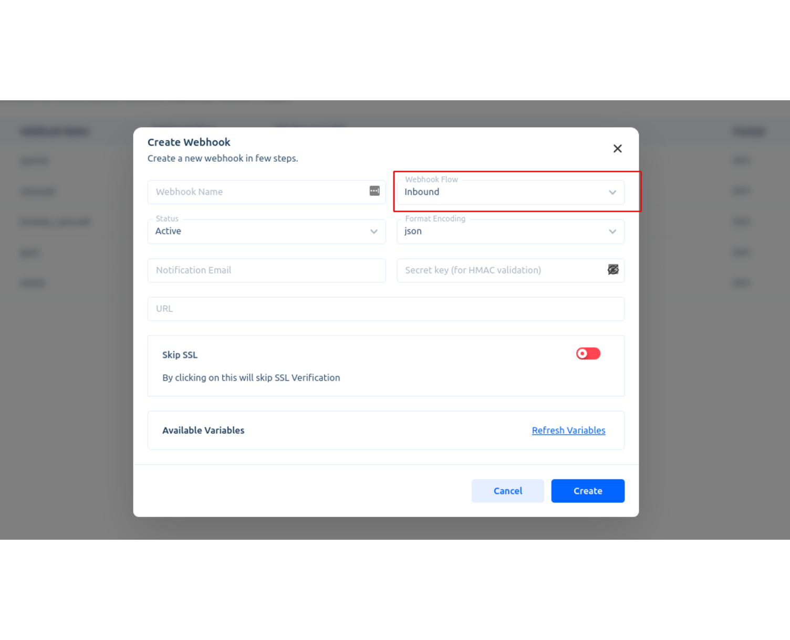

# Webhooks in chatbot

Customize the flow of your bot conversations with webhooks. Acquire’s webhooks are universal, meaning that agents and bots may share dynamic data. This tutorial will walk you through setting up a webhook and connecting it to a chatbot.


Chatbot webhooks configurations guide,[ click here](https://help.acquire.io/chatbots/webhooks-for-chatbots)


