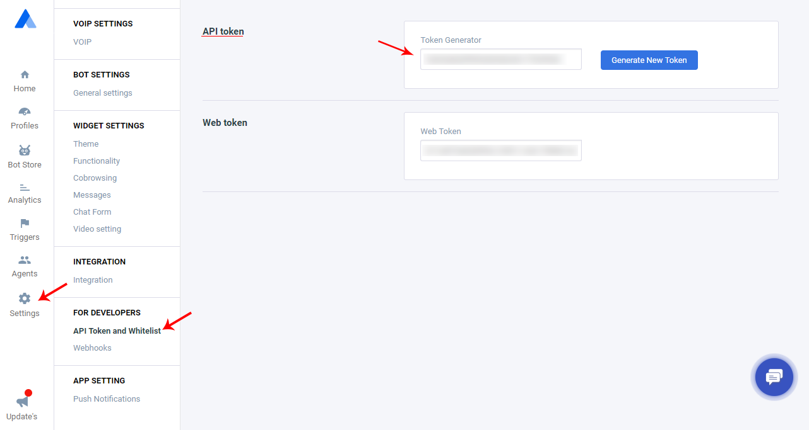

# Authorization

Welcome to the Acquire Developer Docs. Whether you're looking to use our **REST APIs**, receive notifications with webhooks, or build an app for the Acquire , you've come to the right place.

To access the Acquire API, you'll need a token. The type of token you need depends on your use case:

* Use Access Tokens if you're using the API to access data in your own Acquire workspace.
* Use OAuth if you're building a publicly-available app that accesses other people's Acquire data.

#### **Access tokens**

You should use an Access Token if:

* You want to use the API to interact with your own Acquire app
* You have scripts to push or extract data from your Acquire app
* You want to use the API to programmatically automate certain actions in your own Acquire app
* The data you interact with programmatically is your own customer data

#### **How to get an Access Token**

We provide an Access Token as soon as you create an app on your workspace. First login Acquire dashboard and Go **Setting &gt; API Token and Whitelist &gt; API Token** \( [https://app.acquire.io/setting/token](https://app.acquire.io/setting/token) \). Copy API token and use api header in auth\_token parameter. If you want to new token generate click on button "**Generate New Token**".



Your Access Token can give access to your private Acquire data and should be treated like a password. If an app provider asks you for your Access Token, please do not provide it. Instead, let us know - apps are required to use OAuth rather than asking users for Access Tokens.

You should use OAuth if:

* You are requesting access to other people's Acquire accounts/data \(for example, through an integration you've built\)
* You currently ask people for their API Keys to request resources on their behalf
* You want to make it easier for your customers to share their customers' data with you


 Never ask users for their Access Token  
Asking your users for their Access Tokens rather than implementing **OAuth** is against our terms of service and may result in your API access being revoked.


#### **How to use your Token**

To use your Token, simply provide it as part of the authorization header when you make a request. Tokens use the bearer authorization header when you make a request. This just means you need to specify the bearer type in the header.

#### **Sample Code**

```javascript
curl -X POST \
  https://app.acquire.io/profile/lead/list \
  -H 'Authorization: Bearer <API_AUTH_TOKEN>' \
  -H 'Content-Type: application/x-www-form-urlencoded' \
```

