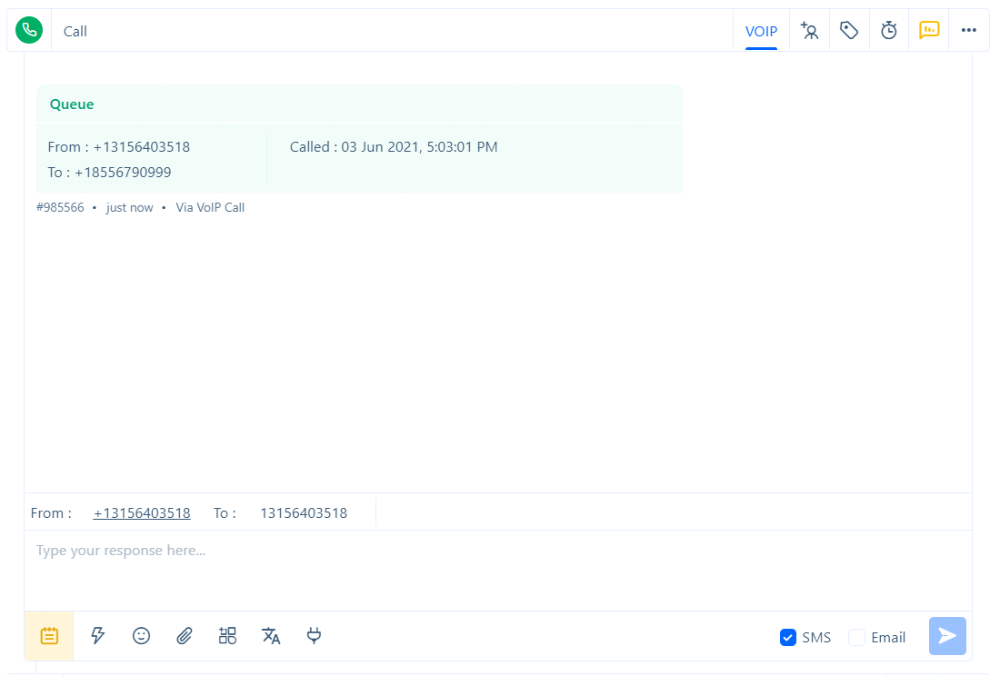

# Phone

Integrate voice data into Acquire. These endpoints allow you to monitor and analyze audio data and integrate and interact with other telephony services. 

### Attributes 

| ATTRIBUTE | TYPE | DESCRIPTION |
| :--- | :--- | :--- |
| CallId | String | Specify the ID of the call. |
| From | String | Specify the phone number of the caller 'From'. |
| To | String | Specify the phone number of the callee 'To'. |
| CallStatus | String | Specify the call status. \['busy','no-answer','canceled','failed','completed'\] |
| Duration | Number | Specify the call duration in seconds. |
| Direction | String | Specify the call direction. '**outgoing** \| **incoming**' |
| RecordingUrl | String | Specify the call recording URL.  |
| email | String | Specify the email of the callee. |

### Permissions

Permission and API Keys are not required to request a telecommunication-outsider endpoint.

