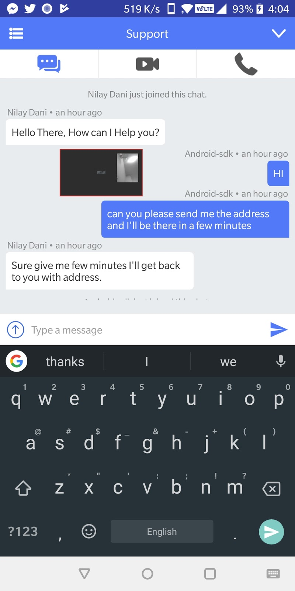

# Acquire APIs

### Chat APIs:

Start chat module directly by calling **`startSupportChat()`**

```java
AcquireApp.startSupportChat()
```

This method is used to open chat. To use this method **AcquireApp** instance is needed. So use this method after successful initialization.

**Alternate Method :** **`startDirectSupportChat(callType: CallType)`**

```java
AcquireApp.startDirectSupportChat(CallType.VIDEO)
```

* **@param** **`callType`** - TEXT, AUDIO, VIDEO

Use this method to start direct Audio/Video call request to agent. By this method , Audio/Video chat request will be visible to the agent and on answer to that chat will start Audio/Video call as soon as chat is connected.

### Verify your users:

Make sure your users are who they claim to be with identity verification. Enforce identity verification to prevent other from pretend to be \(third party\) for entertainment or fraud logged-in users.

Generate an HMAC with SHA256 whenever a user logs into your app. Most web frameworks will have a method or library to help you do this. You'll need your app’s secret key and the email of the currently logged-in user.

### **Secret Key**

#### &lt;YOUR\_SECRET\_KEY&gt;

For example, in Ruby on Rails we can generate our **HMAC** using a method called **`OpenSSL::HMAC.hexdigest`**, where the first parameter is the name of a hash function \(we use **SHA256**\), the second is your secret key, and the third is your user’s email.

```javascript
OpenSSL::HMAC.hexdigest(
  'sha256', # hash function
  '<YOUR_SECRET_KEY>', # secret key (keep safe!)
  current_user.email # user's email address
)
```


 Keep your secret key safe! Never commit it directly to your repository, client-side code, or anywhere a third party can find it.


To set up identity verification, you'll need to generate an HMAC on your server for each logged-in user and set in acquireIO SDK.

**`setVisitorHash`** must be called before **`init()`** takes place and must pass same email in **`setVisitorDetail()`**.

```javascript
AcquireApp.setVisitorHash([STRING_YOUR_HMAC_EMAIL])
```

First, you need to add email id in **`setVisitorDetail()`** method in SDK for uniquely identify your users. Note that if you set only visitor hash and email is not set then acquire can't identify visitor. So you need both method to verify visitor hash.

```javascript
AcquireApp.setVisitorDetail([STRING_NAME], [STRING_EMAIL], [STRING_PHONE_NUMBER], [STRING_DEPARTMENT])
```

**Get Visitor ID using method:**

**`AcquireApp.getVisitorId()`**

### **Logout visitor**

If you have set visitor hash \(**HMAC digest**\) and visitor just logged out from account and need to manage user integrity with agent, call method **logOut\(**MutableLiveData loggedOut**\)** to remove all acquire data from your app related to **visitorHash** use method :

```java
AcquireApp.logOut(MutableLiveData loggedOut);
```

Pass null instead of MutableLiveData if you do not required a callback.

#### This method will reset visitor’s all data and stops all connections to the agent including ongoing call.


**Caution:** Please take a note that all methods of the sdk will stop working after logout so resulting in crash on some method calls. You need to re-initialize the sdk to start again.


### User APIs:

#### Set user details

Set your user details as per your need 

You can customize visitor’s identification by calling our sdk’s method **setVisitorDetail**.

**Method Description : `setVisitorDetail(name: String, email: String, phone: String, fields: JSONObject)`**

* **`@param name`** - the name you want to display for the visitor
* **`@param email`** - the email you want to display for the visitor
* **`@param phone`**  - the phone you want to display for the visitor
* **`@param fields`**  - pass the extra fields within a `JSONObject` e.g.

```javascript
 val jsonObject = JSONObject()
        try {
            jsonObject.put([name] : "sample", [value] :"sucess")
        } catch (e: JSONException) {
            e.printStackTrace()
        }
```


Alternate visitor detail methods are:

**`setVisitorDetail(name: String, email: String, phone: String, department: String, fields: JSONObject)`**


**Note:** Use this method before initialization of sdk otherwise wont work.


To set visitor remarks use below method:

```text
AcquireApp.setVisitorRemarks(visitorRemarks: String)
```

### Show Floating Video \(PIP mode\):

Show Floating Video \(PIP mode\) everywhere in your app when audio/video call is active.



### setMainVideoFrameSize\(width, height\):

Use this method to change the default size of the main video window size.

### setSecondaryVideoFrameSize\(width, height\)

Use this method to change the default size of the secondary video window size.


