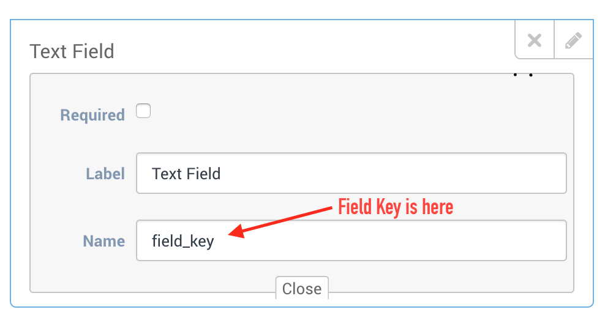

# SDK Configuration Example

In iOS 10, Before you access privacy-sensitive data like Camera, Microphone, and so on, you must ask for the authorization, or your app will crash when you access them.

Open the file in your project named `info.plist`, right click it, opening as Source Code, paste this code below to it. Or you can open `info.plist` as `Property List` by default, click the add button, Xcode will give you the suggest completions while typing Privacy - with the help of keyboard and

Remember to write your description why you ask for this authorization, between `<string>` and `</string>`, or your app will be rejected by apple:

```markup
<!-- Allow Camera -->
<key>NSCameraUsageDescription</key>
<string>$(PRODUCT_NAME) use camera for video chat</string>

<!-- Allow Microphone -->
<key>NSMicrophoneUsageDescription</key>
<string>$(PRODUCT_NAME) use microphone for voice chat</string>

<!-- Allow Photo Library -->
<key>NSPhotoLibraryUsageDescription</key>
<string>$(PRODUCT_NAME) send photo/video to agent</string>
```

## Swift Example

```javascript
import AcquireIO

func application(_ application: UIApplication, didFinishLaunchingWithOptions launchOptions: [UIApplicationLaunchOptionsKey: Any]?) -> Bool {
    ...
    let option: NSDictionary = []

    let config = AcquireIOConfig.config()
    config.setDict(option as! [AnyHashable : Any])

    AcquireIO.support().setAccount("<YOUR_ACCOUNT_UID>", withOptions: config)
    ...
    
    return true
}
```

#### Use in Controller <a id="use-in-controller"></a>

```javascript
import AcquireIO

//Call this method to open support view

AcquireIO.support().showSupport(self)
```

## Objective-C Example

```javascript
#import <AcquireIO/AcquireIO.h>
    
- (BOOL)application:(UIApplication *)application didFinishLaunchingWithOptions:(NSDictionary *)launchOptions{
    ...
    //Required for init support

    NSDictionary *option = @{};

    AcquireIOConfig *config = [AcquireIOConfig config];
    [config setDict:option];

    [[AcquireIO support] setAccount:@"<YOUR_ACCOUNT_UID>" withOptions:config];
    ...

    return YES;
}
```

#### Use in Controller: <a id="use-in-controller-"></a>

```javascript
#import 
    
//Call this method to open support view

[[AcquireIO support] showSupport:self];
```

## Configuration Options Dictionary

```javascript
//Objective C
NSDictionary *options = @{@"OptionKey":Value};
```

```swift
//Swift 3.0
let options:NSDictionary = ["OptionKey" : Value]
```


Note: These config options optional key.


* `UseDefaultTheme` - If you want to use default theme of SDK, even ThemeConfig.plist exist. Default value `@NO`.
* `ShowAvatar` - If you want to hide avatar image from chat list then use this method. Default value `@NO`.
* `ScreenShareBorder` - this is optional key. If you want to show red color border when screen share with agent, then use this method. Default value `@YES`.
* `ShowChatButton`  - Show starting acquire chat button. Default value `@YES`.
* `ShowVideoButton` - Show video button in top tab list on visitor's main chat messages screen and its just hide button but video functionality will not affect by this option. Default value `@YES`.
* `ShowAudioButton` - Show audio button in top tab list on visitor's main chat messages screen and its just hide button but audio functionality will not affect by this option. Default value `@YES`.
* `WebSocketServer` - Initialize AcquireIO chat with custom server, Websocket server ip or url to connect support socket server, this is optional, if not set default AcquireIO socket server will connect. Default value AcquireIO server.
* `ShowLocalNotificationBackgroundState` - Show local notification when app is in background state.. Default value `@YES`.
* `ShowLocalNotificationInApp` - Show in-app notification when app state is active state.. Default value `@YES`.
* `ButtonImageName` - This is init key for initialize AcquireIO chat with system button bottom right Set image name should be put in main bundle of app. Image size 30x30 px, 60x60 px for @2x. Default value `nil`.
* `ShowDefaultStopButton` - After session is connected you can choose to show our stop button or not. Set `@NO` to hide the stop button.

## Set Visitor Data

### Identifier

Set an visitor identifier for your visitor.

This is part of additional visitor configuration. The user identifier will be passed through to the admin dashboard as "User ID" under customer info.


Available in SDK version 1.0.0 or later


**Parameters**

| Parameter | Type | Description |
| :--- | :--- | :--- |
| `visitorIdentifier` | `String` | A string to identify your visitor. |

#### Sample Code

If you want to identify your visitor with any remarkable identity like reference identity from your db or any id, i.e. your visitor is logged in app user account and id is 123456, so you can identify your actual user in your acquire support.



```objectivec
[[AcquireIO support] setVisitorIdentifier:@"123456"];
```



```swift
AcquireIO.support().setVisitorIdentifier("123456");
```



### Basic Detail

Set the name, phone and email of the app visitor.

This is part of additional visitor configuration. If this is provided through the api, user will not be prompted to re-enter this information again. Pass nil values for both name and email to clear out old existing values.


Available in SDK version 1.0.0 or later


**Parameters**

| **Parameter** | Type | Description |
| :--- | :--- | :--- |
| `name` | `String` | The name of the user. |
| `phone` | `String` | The phone of the user. |
| `email` | `String` | The name of the user. |

#### Sample Code



```objectivec
[[AcquireIO support] setVisitor:@"Name of visitor or nil" phone:@"Phone of visitor or nil" andEmail:@"Email of visitor or nil"];
```



```text
AcquireIO.support().setVisitor("Name of visitor or nil", phone:"Phone of visitor or nil", "Email of visitor or nil");
```



### Custom Fields

Set the extra detail of the app visitor.

This is part of additional visitor configuration. If this is provided through the api, user will not be prompted to re-enter this information again. Pass nil values for data to clear out old existing values.

**Parameters**

| **Parameter** | Type | Description |
| :--- | :--- | :--- |
| `fields` | `Array` | array of field. field dictionary format: `{"n":"field_key","v":"field_value"}.` |



#### Sample Code

Set extra custom field for zip, branch and company. see below:



```javascript
NSArray *custom_fields = @[
                               @{@"n":@"zipcode", @"v": @"54321"},
                               @{@"n":@"acbranch", @"v": @"XXX"},
                               @{@"n":@"company", @"v": @"XYZ Company"}
                               ];
  
    
[[AcquireIO support] setVisitorExtraField:custom_fields];
```




```javascript
let custom_fields = [
            ["n":"zipcode", "v":"54321"],
            ["n":"acbranch", "v": "XXX"],
            ["n":"company", "v": "XYZ Company"]
        ]
        
AcquireIO.support().setVisitorExtraField(custom_fields)
```




### Verified Hash



### Logout

If you have set visitor hash \(HMAC digest\) and visitor just logged out from account and need to manage user integrity with agent, call method logoutVisitor to remove all acquire data from app related to visitorHash.


This should be called when visit logged out. Available in SDK version 1.0.8 or later


**Sample Code**



```text
[[AcquireIO support] logoutVisitor];
```



```text
AcquireIO.support().logoutVisitor();
```



## Methods

* `setAccount: withOptions:` - This is init method for initialize AcquireIO chat. When you calling setAccount method you must pass one accountUID parameter Option can be nil.
* `setVisitorIdentifier:` - Set a visitor identifier for your visitor, can be tracked by admin in remark.
* `setVisitor: phone: andEmail:` - Set the name, phone and email of the app visitor.
* `setVisitorExtraField: fields:` - Set the extra custom field format: {"n":"FIELD\_KEY","v":"FIELD\_VALUE"}.
* `showSupport:` - Show support view controller from current `viewcontroller`, will call after setAccount method done. This method must pass a valid viewController instance.
* `getUnreadCount` - Total unread count of message\(s\).
* `getAvailableAgentCount` - Total unread count of message\(s\).
* `showSupport: withReference:` - Open specific thread of current visitor with reference id.

## Protocol

```text
@Optional
```

* `changeAgentStatus: andStatus:` - When any agent status update. First parameter is agentID and second is status \(AgentStatus enum\).
* `updateUnreadCount` - When receive chat message count will be increase. First parameter is integer count of unread message\(s\).
* `changeConnectionStatus:` Callback when AcquireIO server connection state change. First parameter is status \(ConnectionStatus enum\). Please don't call method for open support view before \`ConnectionStatus\` is \`Connected\`. 
* `hideSupport` When hide acquireIO widget.
* `didReceiveTriggerEvent:` Invoke when you got any event from acquire io trigger.
* `didChangeCobrowseCode:` When change cobrowse code for session.
* `didCobrowseSessionStateChange:` State change for cobrowse session.
* `onCobrowseSessionRequestDecline` SDK ask you to allow cobrowse with agent but you decline. 
* `onCobrowseSessionRequestSucceeded` SDK ask you to allow cobrowse with agent but you accept. 
* `onAgentConnected` Call when connect to cobrowse session
* `onAgentEnded` Call when agent end cobrowse session
* `onSessionFailed` Session failed if any reason
* `onError:` Any error in session with reason.


Note:AcquireIO connection exchanging data asynchronously between app SDK and server. So if you are trying to open `supportViewController` on `ConnectionStatus` is `Connecting` status then it will show message "AcquireIO Error! Session not started yet.".


