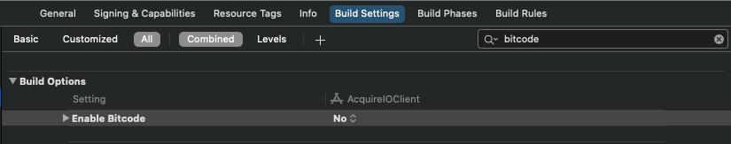
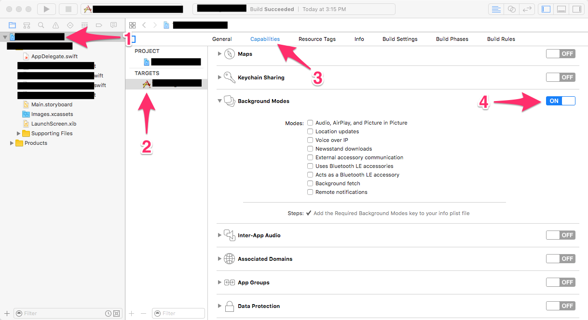

# Integration Guide \(Core\)

## INSTALLATION

To connect AcquireIOSupport Core SDK to your iOS app just add it into your Podfile:

1\) Create a Podfile in your project's root directory, if it doesn't exist yet

2\) Add the **AcquireIOSupport-Core** in Podfile under your desired target:

```markup
target :YourTargetName do
      pod 'AcquireIOSupport-Core'
end
```

3\) The AcquireIOSupport SDK supports module stability and therefore all its dependencies must be built-in with the "Build Libraries for Distribution" setting enabled, however this is not currently supported in Cocoapods. Running the below command will ensure Xcode builds the dependencies with the correct settings. Once Cocoapods supports module stability, this workaround can be removed.

Add the following to the bottom of your Podfile:

```markup
post_install do |installer|
  installer.pods_project.targets.each do |target|
    if ['TwilioVideo', 'Socket.IO-Client-Swift', 'Starscream'].include? target.name
      target.build_configurations.each do |config|
          config.build_settings['BUILD_LIBRARY_FOR_DISTRIBUTION'] = 'YES'
          config.build_settings['ENABLE_BITCODE'] = 'NO'
      end
    end
  end
end
```

4\) Run the below command to install the SDK to your project

```markup
bash

$ pod install --repo-update
```

5\) Open your project using the generated \*.xcworkspace file.


#### **NOTE:** IF YOU ARE NEW TO COCOAPODS, GO TO [COCOAPODS](https://cocoapods.org/) TO LEARN HOW TO INSTALL IT. <a id="note-if-you-are-new-to-cocoapods-go-to-cocoapods-to-learn-how-to-install-it"></a>


Make sure to always open the Xcode workspace instead of the project file when building your project:

```markup
Open MyApp.xcworkspace
```

6\) Make sure to disable **bitcode** for your project: Go to your project's settings and find the **Build settings** tab, check **All** and search for **bitcode**, then set it to **No**.



## SETUP INFO.PLIST


 _Since iOS 10, it's mandatory to add before you access privacy-sensitive data like Camera, Microphone, and so on, you must ask for the authorization, or your app will crash when you access them._


Open the file in your project named info.plist, right-click it, opening as Source Code, paste this code below to it. Or you can open info.plist as Property List by default, click the add button, Xcode will give you the suggested completions while typing Privacy - with the help of keyboard and 

Remember to write your description of  why you ask for this authorization, between and, or your app will be rejected by Apple:

```markup
<!-- Camera -->
<key>NSCameraUsageDescription</key>
<string>$(PRODUCT_NAME) use camera for video chat</string>

<!-- Microphone -->
<key>NSMicrophoneUsageDescription</key>
<string>$(PRODUCT_NAME) use microphone for voice chat</string>

<!-- Photo Library -->
<key>NSPhotoLibraryUsageDescription</key>
<string>$(PRODUCT_NAME) send photo/video to agent</string>
```

Also, The AcquireIOSupport SDK uses background mode Audio for when you are video/voice call to agent/visitor. If you have not enabled then background voice will not work. When the UIBackgroundModes key contains the audio value, the system’s media frameworks automatically prevent the corresponding app from being suspended when it moves to the background

To allow your AcquireIOSupport SDK to play audio in the background, Enable it using the below steps

1\) Select your project file in the Navigator of Xcode. 2\) From the Capabilities section, switch on the **Background Modes** subsection 3\) Switch **ON** the Background Modes subsection. After background modes are listed, tick on the _Audio, Airplay & picture in the picture_



