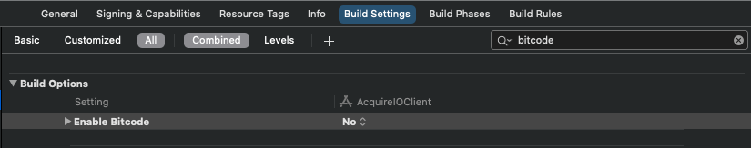

# Integration Guide \(Lite\)

#### INSTALLATION <a id="installation"></a>

To connect AcquireIOSupport Lite SDK to your iOS app just add it into your Podfile:

1\) Create a Podfile in your project's root directory, if it doesn't exist yet.

2\) Add the **AcquireIOSupport-Lite** in Podfile under your desired target:

```text

   target :YourTargetName do
      pod 'AcquireIOSupport-Lite’
   end

```

3\) The AcquireIOSupport SDK supports module stability and therefore all its dependencies must be built in with the "Build Libraries for Distribution" setting enabled, however this is not currently supported in Cocoapods. Running the below command will ensure Xcode builds the dependencies with the correct settings. Once Cocoapods supports module stability, this workaround can be removed.

Add the following to the bottom of your Podfile:

```text
post_install do |installer|
  installer.pods_project.targets.each do |target|
    if [ 'Socket.IO-Client-Swift', 'Starscream'].include? target.name
      target.build_configurations.each do |config|
          config.build_settings['BUILD_LIBRARY_FOR_DISTRIBUTION'] = 'YES'
          config.build_settings['ENABLE_BITCODE'] = 'NO'
      end
    end
  end
end
```

4\) Run the below command to install the SDK to your project.

```text
bash

$ pod install --repo-update
```

5\) Open your project using the generated \*.xcworkspace file.

> #### **NOTE:** IF YOU ARE NEW TO COCOAPODS, GO TO [COCOAPODS](https://cocoapods.org/) TO LEARN HOW TO INSTALL IT. <a id="note-if-you-are-new-to-cocoapods-go-to-cocoapods-to-learn-how-to-install-it"></a>

Make sure to always open the Xcode workspace instead of the project file when building your project:

```text
open YourTargetName.xcworkspace
```

6\) Make sure to disable **bitcode** for your project: Go to your project's settings and find the **Build settings** tab, check **All** and search for **bitcode**, then set it to **No**.



#### SETUP INFO.PLIST <a id="setup-infoplist"></a>

> _Since iOS 10, it's mandatory to add before you access privacy-sensitive data like Camera, Microphone, and so on, you must ask for the authorization, or your app will crash when you access them._

Open the file in your project named info.plist, right-click it, opening as Source Code, paste this code below to it. Or you can open info.plist as Property List by default, click the add button, Xcode will give you the suggested completions while typing Privacy - with the help of keyboard and

Remember to write your description of why you ask for this authorization, between `<string>` and `</string>`, or your app will be rejected by Apple:

```text
<!-- Camera -->
<key>NSCameraUsageDescription</key>
<string>$(PRODUCT_NAME) use camera for video chat</string>

<!-- Photo Library -->
<key>NSPhotoLibraryUsageDescription</key>
<string>$(PRODUCT_NAME) send photo/video to agent</string>
```

