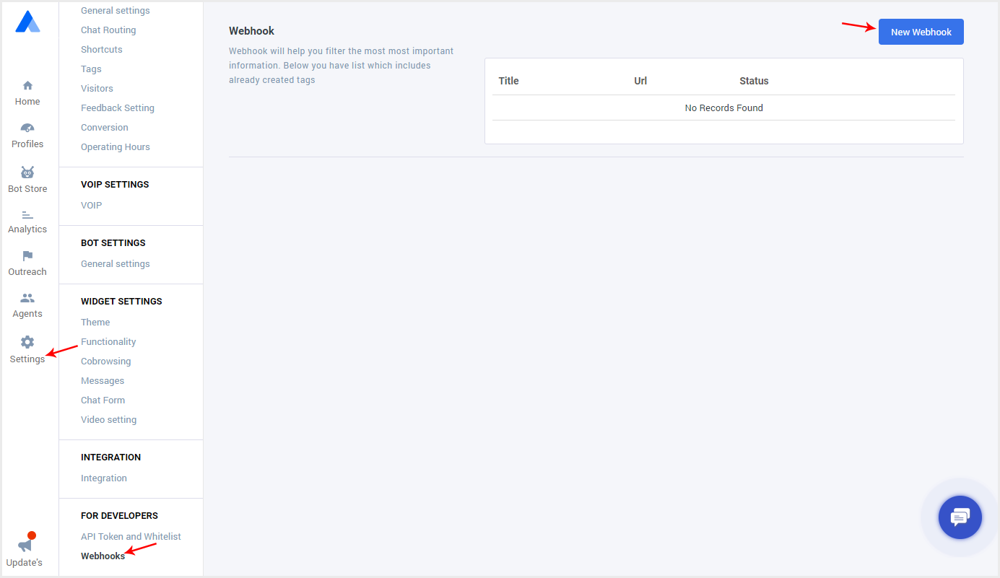
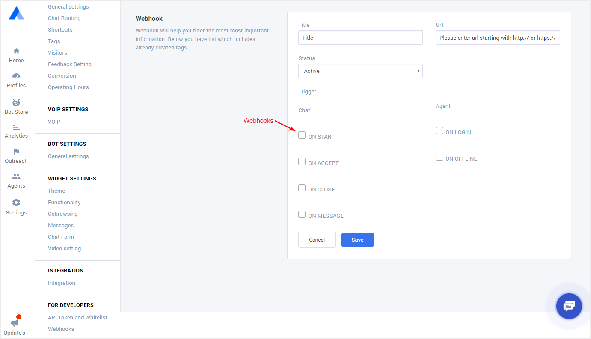

# Webhook Integrate Steps

This tutorial will help you integrate your tools with Acquire chat using webhooks. To use Acquire webhook service, you need to complete the following steps:

#### **Step 1: Sign Up for a free trial account**

This trial account will serve the purpose of sandbox testing for your integration. [Sign Up](https://app.acquire.io/signup)

#### **Step 2: Create webhooks and let us know**

Use this documentation to create webhooks and test them with your integration.

You can configure Acquire chat to instantly notify to about particular events that are happening in your chat. Such notification is called a webhook. It is just a simple POST request that is send to your server when a particular event occurs.

You can create your webhooks in Acquire web application.

#### Setting up the webhooks

Each webhook contains the following properties:

**Title** - Represents your webhook in simple text.

**Url** - Address of the web server at which webhook will be sent to.

**Status** - Determines whether your webhook is 'Active' or 'Disabled'

**Triggers** - Determine when the webhook is sent to server.

