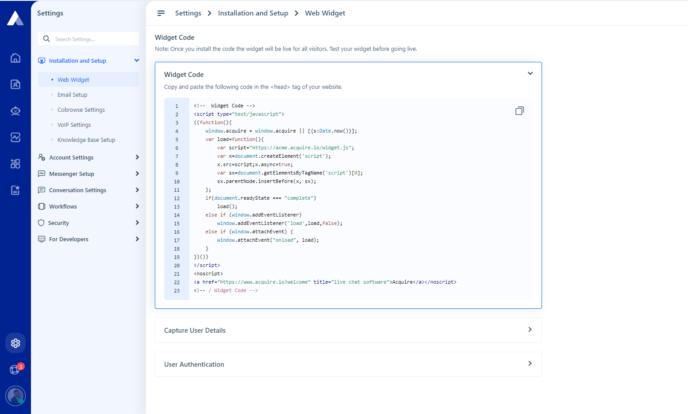

# Installation

### Installation

**Get widget code:**

1. Login to your Acquire account.
2. Go to setting
3. Choose **Installation and Setup** and click on the web widget
4. You will be redirected to the **widget code** page.
5. To connect with your website visitors you will have to embed the **Acquire widget** on your website
6. Copy the Javascript code snippet in the **Head** tag of your website.

Configuring the Acquire Widget is a rapid process that involves copy & paste the code snippet to your website.

